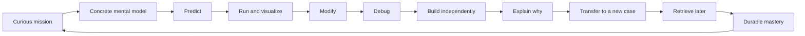

# Sophia Learns Code

> A fun, interactive, evidence-informed Python learning journey from the very first `print()` to independent, advanced programming in cybersecurity and financial forensics.

**Status:** pre-build product design and validation  
**Initial learner:** a college student beginning Python from absolute zero  
**Working experience concept:** **Python Investigator: Flight Deck**  
**Repository purpose:** preserve the product vision, learning design, curriculum, architecture, research, decisions, experiments, and build roadmap so the project can improve without losing its compass.

## The mission

Most coding courses teach recognition: watch an explanation, copy a solution, pass a friendly quiz, and feel productive. The learner then meets a blank editor and the floor disappears.

Sophia Learns Code will train a different ability:

- understand what the computer is doing;
- predict code before running it;
- turn an idea into small, testable steps;
- debug unfamiliar programs without panic;
- retrieve important concepts after time has passed;
- transfer the same idea into a new situation;
- build useful software independently; and
- explain why a solution works and where it may fail.

The destination is not “course completed.” The destination is **capable without the course**.

## Product promise

```text
Assume nothing.
Make invisible execution visible.
Let the learner do something every few moments.
Make errors useful and emotionally safe.
Reward demonstrated capability, not button pressing.
Gradually remove help until independent work feels normal.
```

## The learning loop



A lesson is not a page of prose. It is a short sequence of meaningful actions: choose, predict, arrange, run, inspect, repair, create, explain, and revisit.

## What makes it fun

The platform uses a mature investigation-and-flight-deck tone rather than a childish cartoon skin. Lessons become missions, projects become case files, major assessments become checkrides, and the curriculum becomes an explorable capability map.

Fun must emerge from:

- quick visible cause and effect;
- satisfying “I figured it out” moments;
- playful code puzzles and bug hunts;
- meaningful choices and alternate missions;
- a responsive execution visualizer;
- authentic cyber and financial mysteries;
- surprising but non-manipulative discoveries;
- clear progress toward real independence; and
- projects worth showing another person.

Points, badges, streaks, and unlocks are allowed only when they make real learning more legible. There will be no streak shame, loot boxes, public ranking pressure, or XP farming.

## Zero to advanced

```text
First Run
  → Values and Variables
  → Decisions and Loops
  → Collections and Functions
  → Debugging and Problem Decomposition
  → Files, CSV, JSON, Regular Expressions, Dates
  → Testing, Git, Packages, APIs, SQL, Logging, Types
  → Cybersecurity and Financial-Forensics Investigations
  → Data Structures, Algorithms, Design and Architecture
  → Generators, Decorators, Context Managers, Async and Concurrency
  → Independent Portfolio-Grade Capstones
```

Every conceptual rung must be taught. No syntax teleportation.

## Product pillars

1. **Action before passivity.** The learner should rarely go more than a minute without making a meaningful decision.
2. **Mental models before memorized syntax.** Show state, references, control flow, stack frames, and data movement.
3. **Mastery before completion.** Watching a video is activity, not evidence of learning.
4. **Support that fades.** Move from worked example to partial example to independent creation to novel transfer.
5. **Feedback that teaches.** Explain the discrepancy, likely misconception, and useful next action.
6. **AI as coach, never answer vending machine.** Deterministic tests judge code; AI diagnoses and teaches.
7. **Authentic purpose.** Foundational concepts quickly connect to safe cybersecurity and financial-analysis cases.
8. **Professional escape velocity.** The platform eventually transitions the learner into local Python, VS Code, Git, tests, and GitHub.
9. **Evidence over vibes.** Retention and transfer are measured after delays.
10. **Learner dignity.** Adult tone, privacy, accessibility, autonomy, and emotionally safe failure are non-negotiable.

## Documentation map

| Document | Purpose |
|---|---|
| [`docs/00-product-charter.md`](docs/00-product-charter.md) | Mission, audience, outcomes, principles, and boundaries |
| [`docs/01-learner-journey.md`](docs/01-learner-journey.md) | The real human experience from first click to independence |
| [`docs/02-learning-science.md`](docs/02-learning-science.md) | Evidence base and how each principle becomes a product behavior |
| [`docs/03-interactivity-and-fun.md`](docs/03-interactivity-and-fun.md) | Interaction grammar, narrative, motivation, and humane gamification |
| [`docs/04-curriculum-map.md`](docs/04-curriculum-map.md) | Full zero-to-advanced curriculum with exit criteria and projects |
| [`docs/05-lesson-design-system.md`](docs/05-lesson-design-system.md) | Repeatable anatomy and quality bar for every lesson |
| [`docs/06-mastery-and-assessment.md`](docs/06-mastery-and-assessment.md) | Evidence ledger, review scheduling, grading, and transfer |
| [`docs/07-ai-tutor-spec.md`](docs/07-ai-tutor-spec.md) | Tutor modes, hint ladder, structured contract, integrity, and evaluations |
| [`docs/08-technical-architecture.md`](docs/08-technical-architecture.md) | Browser execution, visualizer, services, data, security, and staging |
| [`docs/09-mvp-roadmap.md`](docs/09-mvp-roadmap.md) | Smallest valuable vertical slice and staged delivery plan |
| [`docs/10-sophia-pilot-plan.md`](docs/10-sophia-pilot-plan.md) | Observation protocol and success measures for the first learner |
| [`docs/11-research-and-benchmarks.md`](docs/11-research-and-benchmarks.md) | Research ledger and patterns to study from existing platforms |
| [`docs/12-risks-and-guardrails.md`](docs/12-risks-and-guardrails.md) | Pedagogical, privacy, AI, execution, cyber-safety, and product risks |
| [`docs/13-decisions.md`](docs/13-decisions.md) | Durable product and architecture decision log |
| [`ROADMAP.md`](ROADMAP.md) | Current phases, gates, and near-term priorities |
| [`content/schema/lesson.schema.yaml`](content/schema/lesson.schema.yaml) | Versioned content contract |
| [`content/examples/phase-0/001-first-contact.yaml`](content/examples/phase-0/001-first-contact.yaml) | Concrete absolute-zero lesson specimen |

## North-star outcome

After enough practice, Sophia should be able to receive an unfamiliar but bounded problem, inspect the evidence, define the steps, build a tested solution, explain her decisions, and identify the solution’s limits without depending on the tutor.

The primary product metric is therefore:

> **Independent success on delayed, unfamiliar transfer tasks.**

Supporting measures include hint depth, debugging quality, misconception recurrence, delayed retrieval, project quality, explanation quality, and successful movement into professional tools.

## Initial build target

The first implementation is intentionally narrow:

- desktop-first web experience;
- first 30 minutes from zero experience;
- five polished lessons rather than fifty shallow ones;
- browser-based Python execution;
- predict, trace, arrange, modify, debug, and write interactions;
- deterministic tests and misconception-aware feedback;
- a minimal execution visualizer;
- one constrained AI tutor mode;
- a simple mastery evidence ledger; and
- one tiny investigation that combines the first concepts.

Video libraries, public leaderboards, native mobile apps, large social systems, and elaborate cloud cyber ranges are explicitly outside the first vertical slice.

## Public-repository note

This repository is currently public. Product documents and synthetic lesson content belong here. Real student records, assessment histories, conversations, credentials, school records, private datasets, or personally identifying analytics do not. Learner data must live in protected systems with explicit consent and deletion controls.

## Working rules

- Research claims should cite their sources.
- New mechanics must state the learning behavior they are intended to cause.
- Every lesson must define observable mastery evidence.
- Every feature must be testable with a real learner.
- AI-generated content requires deterministic validation and human review.
- Decisions that change product direction belong in `docs/13-decisions.md`.
- Build the learner loop before building platform ornamentation.

## Current milestone

**Milestone 0: Validate the first-session experience on paper and in a clickable/code-running prototype.**

The next durable question is not “Which framework should we install?” It is:

> Can a complete beginner have a genuine first win, understand what happened, enjoy the experience, recover from a small error, and voluntarily continue?
