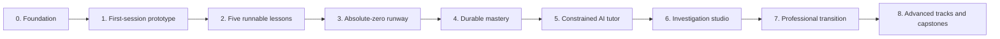

# Sophia Learns Code Roadmap

This roadmap is organized around evidence from real learning, not the number of features shipped.

## Current status

**Current phase:** Milestone 0, product foundation  
**Current gate:** prepare and validate the first-session experience  
**North-star outcome:** independent success on delayed, unfamiliar transfer tasks

The foundational product, curriculum, learning-science, interactivity, mastery, AI, architecture, pilot, risk, research, and decision documents are now established.

## Delivery map

## Milestone 0: Foundation

### Goal

Create a durable product authority before implementation choices begin pulling the project in different directions.

### Deliverables

- [x] Product charter
- [x] Human learner journey
- [x] Learning-science translation
- [x] Interactivity and humane gamification design
- [x] Zero-to-advanced curriculum map
- [x] Lesson design system
- [x] Mastery and assessment model
- [x] AI tutor specification
- [x] Technical architecture
- [x] MVP delivery strategy
- [x] Sophia pilot protocol
- [x] Research and benchmark ledger
- [x] Risk register and guardrails
- [x] Product and architecture decision log
- [x] Versioned lesson schema
- [x] First absolute-zero lesson specimen
- [x] Initial GitHub planning issues

### Exit gate

- [ ] Review documents for contradictions and missing assumptions
- [ ] Review the first lesson specimen line by line
- [ ] Convert the first 15 minutes into a storyboard
- [ ] Confirm the initial learner’s preferred tone, session length, and mission flavor
- [ ] Record unresolved product decisions as issues

## Milestone 1: First-session prototype

### Goal

Test whether a complete beginner understands, enjoys, and controls the opening experience before building a general learning engine.

### Scope

- mission briefing;
- code-looking editor;
- Run control and console;
- personalized first output;
- predict-before-run interaction;
- simple execution animation;
- intentional syntax error;
- emotionally safe repair sequence;
- first name/value visualization;
- debrief; and
- capability-map reveal.

The first version may use scripted execution where that accelerates experience validation.

### Exit gate

- learner finds and uses Run without observer rescue;
- learner distinguishes code from output;
- learner changes the program rather than only copying it;
- learner makes a meaningful prediction;
- learner repairs the designed error using product support;
- learner can explain one state change;
- tone feels adult and welcoming;
- passive stretches remain short; and
- the session produces at least one moment of voluntary experimentation.

## Milestone 2: Five runnable lessons

### Goal

Replace scripted behavior with real Python and validate one complete instructional loop.

### Lessons

1. **First Contact**
2. **Names and Values**
3. **Make a Decision**
4. **Repeat the Signal**
5. **Case 001**

### Platform capability

- browser Python worker;
- stdout and error capture;
- timeout, cancellation, and reset;
- bounded line/state trace;
- prediction, trace, code-ordering, modification, repair, and independent-write blocks;
- deterministic tests;
- authored hint ladders;
- local evidence ledger; and
- a short delayed review.

### Exit gate

- reference solutions and misconception variants are automatically validated;
- runaway code cannot freeze the interface;
- trace snapshots are correct for the supported language subset;
- the complete sequence requires no local setup;
- a novice completes the final mission without solution reveal; and
- delayed evidence shows meaningful retention.

## Milestone 3: Absolute-zero runway

### Goal

Build the complete Phase 0 bridge from first click to stable foundations.

### Scope

Approximately 15 to 25 compact lessons covering:

- interface and execution;
- strings and numbers;
- variables;
- input and conversion;
- comparisons and Booleans;
- conditionals and indentation;
- simple loops;
- first errors and tracebacks;
- basic decomposition; and
- a synthesis mission.

### Exit gate

The learner independently meets every Phase 0 exit criterion in `docs/04-curriculum-map.md`, including a delayed and changed-context task.

## Milestone 4: Durable mastery

### Goal

Prove that the platform supports remembering and transfer, not merely immediate success.

### Scope

- authenticated progress;
- evidence ledger;
- transparent mastery states;
- spaced review queue;
- misconception tracking;
- checkrides;
- near and far transfer; and
- learner-visible explanations for every capability state.

### Exit gate

- support level correctly changes evidence classification;
- review volume remains humane;
- learners can return after absence without shame or backlog shock;
- delayed retrieval is measured; and
- transfer performance is visible separately from lesson completion.

## Milestone 5: Constrained AI tutor

### Goal

Add adaptive explanation and debugging without turning the platform into a homework answer generator.

### Scope

- Explain, Nudge, and Debug Coach modes;
- structured input and output contracts;
- deterministic test and trace grounding;
- authored hint ceilings;
- direct-explanation escape hatch;
- parallel recovery tasks after full reveal;
- academic-integrity mode;
- cyber-safety policy;
- privacy redaction; and
- versioned tutor evaluations.

### Exit gate

- tutor never overrides execution evidence;
- tutor remains within reveal policy;
- tutor handles frustration without endless questioning;
- likely graded work and unsafe cyber requests are handled correctly;
- secret-paste scenarios pass;
- lessons still work when AI is unavailable; and
- observed learners recover more effectively without losing independent action.

## Milestone 6: Investigation studio

### Goal

Let learners use foundational Python on meaningful, synthetic evidence.

### Scope

- file and dataset workspace;
- CSV and JSON cases;
- synthetic cyber and transaction evidence;
- multi-step investigation flow;
- findings notebook;
- deterministic transformations;
- project artifacts;
- reporting; and
- learner-controlled mentor sharing.

### Exit gate

- learner can explain provenance, transformation, and limitations;
- anomaly language does not imply guilt;
- work is reproducible;
- no real sensitive data is required; and
- a shareable artifact is produced.

## Milestone 7: Professional transition

### Goal

Move capability out of the learning platform and into real engineering workflows.

### Scope

- files and project roots;
- terminal;
- local Python;
- virtual environments;
- dependency management;
- pytest;
- Git and GitHub;
- issues, branches, commits, and pull requests;
- project export; and
- local checkrides.

### Exit gate

The learner completes a tested task locally, commits it, opens or reviews a pull request, and diagnoses common environment problems without the platform executing the solution for her.

## Milestone 8: Advanced tracks and capstones

### Goal

Support advanced Python, computer science, cybersecurity, financial forensics, and independent system design.

### Scope

- professional data engineering;
- secure coding;
- defensive security analysis;
- financial-forensics pipelines;
- algorithms and complexity;
- object and interface design;
- iterators and generators;
- decorators and context managers;
- async and concurrency;
- packaging and architecture; and
- portfolio-grade capstones.

### Exit gate

Learners can define ambiguous requirements, build and test a nontrivial system, explain tradeoffs, evaluate limitations, and work independently outside the platform.

## Immediate priorities

1. Storyboard the complete First Contact lesson from entry through debrief.
2. Conduct a paper or clickable playtest before general implementation.
3. Spike Pyodide in a Web Worker on representative student laptops.
4. Prototype state snapshots for assignment, `print`, comparison, `if`, and `for`.
5. Implement schema validation for lesson files.
6. Author the remaining four lessons in the first vertical slice.
7. Establish an anonymized experiment-report format.
8. Decide repository license and contribution posture before accepting outside contributions.

## Release gates for every milestone

### Product

The learner understands the interface, goal, and next action.

### Pedagogy

The target capability has independent, delayed, and transfer evidence appropriate to the stage.

### Delight

Curiosity, control, visible consequence, and earned satisfaction are present without manipulation.

### Accessibility

Equivalent paths exist for keyboard, screen reader, reduced motion, captions, and non-color-only meaning.

### Safety and privacy

Execution, AI, data, academic-integrity, cybersecurity, and sharing boundaries pass review.

### Engineering

The runtime, tests, failure recovery, observability, and content pipeline are sufficient for the current slice.

## Things deliberately waiting outside the first airlock

- native mobile coding application;
- public leaderboard;
- punitive daily streaks;
- large social network;
- marketplace or payments;
- hundreds of videos;
- multiple learner-facing AI agents;
- elaborate cloud cyber ranges;
- automated certification claims;
- generalized LMS features; and
- infrastructure designed for hypothetical scale.

## Roadmap rule

A milestone advances when learner evidence clears its gate, not when its checklist merely looks busy.
