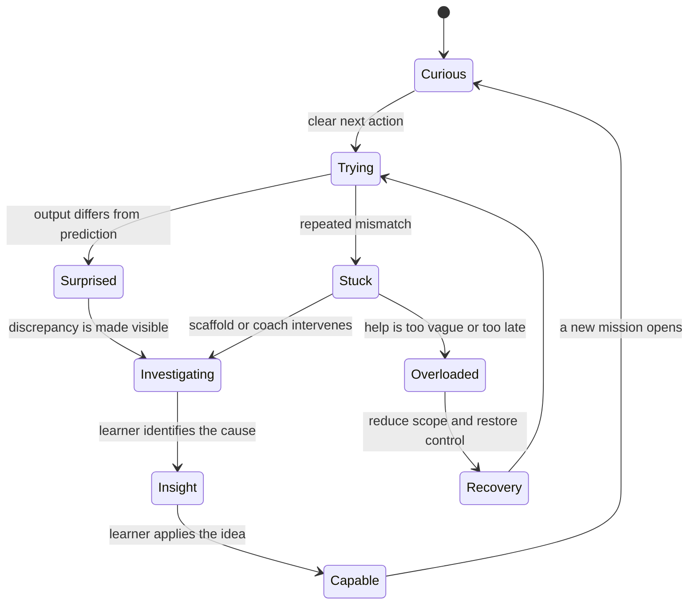
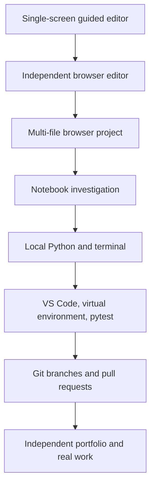

# Learner Journey: From First Click to Independent Engineer

This document describes the product from the learner’s side of the glass. Architecture exists to support this journey, not the reverse.

## 1. Human realities

A true beginner does not merely lack Python syntax. She may not yet know:

- where code is supposed to go;
- which parts are typed and which parts are output;
- what a function call is;
- why punctuation matters;
- whether spaces are meaningful;
- what “run” means;
- why the program starts at the top;
- what a file, path, terminal, process, package, or environment is;
- how to distinguish a mistake in logic from invalid syntax;
- how long being stuck is normal; or
- how experts decide what to try next.

The platform must expose these hidden rules without delivering an opening lecture about twenty hidden rules.

The learner is also a person with classes, work, family, sleep, confidence fluctuations, and a limited attention budget. A session must be valuable whether she has twelve minutes or an hour.

## 2. Emotional arc

A healthy journey repeatedly moves through this arc:



The desired emotion is not constant ease. Useful difficulty is part of learning. The product must distinguish **productive struggle** from **unproductive confusion**.

## 3. The first 15 minutes

The opening experience must not begin with account forms, a syllabus, terminology, or a ten-minute video.

### Minute 0:00 to 0:45 — Arrival

The learner sees one calm screen:

```text
MISSION 001: FIRST CONTACT
Bring the console online by sending it a message.

[ Code area ]                 [ Console ]
print("Hello, Sophia!")       waiting...

                    [ RUN ▶ ]
```

A one-sentence orientation labels the code area, Run control, and console. The cursor is already in the correct place.

### Minute 0:45 to 1:30 — First consequence

She presses Run. The console responds. The interface briefly traces:

```text
Python reads the line
      ↓
finds the print instruction
      ↓
uses the text inside the parentheses
      ↓
sends that text to the console
```

There is delight, but no giant confetti cloud that obscures the idea.

### Minute 1:30 to 3:00 — Ownership

The platform asks her to change the message to anything she chooses. She is not copying anymore. The result reflects her decision.

### Minute 3:00 to 4:30 — Prediction

Two lines appear. Before Run is available, she predicts whether the console will show one line or two. The interface reveals the result and shows execution order.

### Minute 4:30 to 6:30 — Safe breakage

The lesson invites her to remove one quotation mark. The program fails. The error panel translates the event:

```text
Python found the beginning of some text,
but reached the end of the line before finding its closing quote.

Expected: a matching "
Observed: end of line
Useful next inspection: compare the opening and closing punctuation
```

She repairs it herself.

### Minute 6:30 to 9:00 — First variable

A labeled storage card appears beside the code:

```python
investigator = "Sophia"
print(investigator)
```

The visualizer shows the name being associated with the value. It deliberately avoids saying that a variable is literally a physical box forever; later lessons refine the model into names and object references.

### Minute 9:00 to 12:00 — Tiny mission

She completes a small case banner:

```python
investigator = "Sophia"
case_number = 101

print("Investigator:", investigator)
print("Opening case:", case_number)
```

One piece is omitted or rearranged. She supplies it.

### Minute 12:00 to 15:00 — Debrief and choice

The platform asks three short questions:

- What did `print` cause?
- What changed when the text changed?
- What clue helped repair the broken line?

Then she chooses one of two next missions with the same learning target but different flavor:

- **Access Badge:** print and store a security clearance label.
- **Expense Case:** print and store an investigation amount.

Choice creates ownership without fragmenting the curriculum.

## 4. The first-session success contract

A first session is successful only when the learner:

- runs code;
- modifies code;
- predicts an outcome;
- sees code execute step by step;
- causes and repairs one error;
- supplies at least one line or expression;
- explains one idea in her own words;
- sees a visible but honest record of progress; and
- voluntarily knows what she could do next.

“Watched onboarding” is not success.

## 5. The repeatable session rhythm

A normal 15-to-25-minute session should have a recognizable rhythm:

```text
30–60 sec   Re-entry retrieval
2–4 min     New idea through a concrete problem
3–5 min     Predict and visualize
3–5 min     Guided modification or code puzzle
4–8 min     Independent mission
1–3 min     Explanation and debrief
30 sec      Choose next action or stop cleanly
```

Longer sessions can chain two loops or continue into project work. The product never punishes stopping at a natural boundary.

## 6. Re-entry after time away

When the learner returns after a day, a week, or a month, do not open with guilt or a wall of overdue cards.

The return experience should say, in effect:

> Welcome back. Let’s wake up the two ideas most useful for your next mission.

The system offers two to five compact retrieval tasks, adjusts the route from evidence, and celebrates recovery rather than continuity. No broken-streak animation appears.

## 7. When the learner is stuck

Stuckness is inferred from a combination of events, never one crude timer:

- repeated runs with the same failure;
- rapid random edits;
- repeated opening and closing of hints;
- long inactivity after an error;
- a self-report such as “I’m lost”;
- failure to predict the current state; or
- cycling between two misconceptions.

### Recovery ladder

1. Restate the goal in concrete terms.
2. Ask what she expected.
3. Highlight the smallest mismatching observation.
4. Offer a visual trace or example with different surface details.
5. Reduce the task to one decision.
6. Offer a Parsons/code-ordering version.
7. Reveal one step and require the learner to finish the rest.
8. Explain the solution, then schedule a fresh equivalent task.

The learner can always request a direct explanation. Autonomy matters more than maintaining a theatrical Socratic ritual.

## 8. When the learner is bored

Boredom can indicate that support has outlived its usefulness. Signals include immediate correct predictions, repeated no-hint success, fast completion with strong explanations, and self-report.

The platform responds by:

- fading labels and visual prompts;
- skipping redundant worked examples;
- increasing input variety and edge cases;
- offering a timed optional challenge without making speed equal mastery;
- introducing a transfer mission;
- allowing an alternate project route; or
- opening the “under the hood” explanation.

Correctly making a task harder is often more respectful than adding animation.

## 9. When the learner is overloaded

Overload feels different from useful difficulty. The learner may not know which object to attend to, may face too many new terms, or may be fighting the interface rather than the concept.

The system should:

- pause new information;
- reduce the visible code region;
- highlight one line and one state change;
- replace prose with a compact diagram;
- define only the next necessary term;
- preserve her work before simplifying;
- provide a worked example with the same structure; and
- offer a clean stopping point.

## 10. Journey stages

| Stage | Typical feeling | Product behavior | Strong evidence |
|---|---|---|---|
| First contact | Curious, cautious | Immediate code consequence; no setup burden | Runs, changes, predicts, repairs |
| Guided explorer | Interested, uncertain | Dense scaffolding and visible execution | Correct trace and modification |
| Pattern builder | Growing confidence | Faded examples and recurring problem patterns | Solves completion and debug tasks |
| Independent builder | Capable, occasionally stuck | Blank-editor tasks with bounded requirements | Generates tested functions without hints |
| Evidence analyst | Purposeful | Realistic files, cases, and reporting | Cleans, analyzes, and explains evidence |
| Professional apprentice | Serious ownership | Git, local tools, reviews, packaging | Maintains multi-file project |
| Advanced engineer | Selective curiosity | Open problems, design tradeoffs, performance | Defends architecture and limitations |
| Independent practitioner | Self-directed | Platform becomes reference and practice gym | Solves new problems outside platform |

## 11. The weekly arc

A useful week contains more than a linear stack of lessons:

```text
New concepts
    +
Short retrieval
    +
One debugging workout
    +
One synthesis mission
    +
One teach-back or code review
```

A possible five-session pattern:

- **Session A:** new concept and guided practice.
- **Session B:** retrieval plus adjacent concept.
- **Session C:** debugging lab using both concepts.
- **Session D:** small authentic mission.
- **Session E:** checkride, reflection, and route choice.

## 12. The first month

The first month should produce a visible body of work, not merely a progress ring.

Possible artifacts:

- personalized greeting program;
- access decision checker;
- suspicious amount rule;
- repeated-login counter;
- transaction summary function;
- mini case report combining input, decisions, loops, collections, and functions.

Each artifact has a “then” and “now” view so the learner can see how her code and reasoning evolved.

## 13. The professional transition

The browser is a runway, not a permanent airport.



The transition is gradual:

- first reveal filenames;
- then reveal folders;
- then provide a simulated terminal;
- then guide local installation;
- then mirror a mission into a real repository;
- then require local tests;
- finally make the platform’s role coaching and review rather than execution.

## 14. Mentor or parent experience

Mentor support is opt-in and learner-controlled. A useful weekly summary contains:

- concepts now durable;
- one developing capability;
- one recurring misconception;
- one completed artifact; and
- one conversation prompt.

It does not expose every keystroke, private tutor conversation, or a simplistic rank.

A valuable fifteen-minute debrief may ask:

- What did the computer believe at this line?
- Which observation led you to the bug?
- Why was this data structure useful?
- What input would break the program?
- Where else could this pattern work?

The mentor need not know the answer in advance.

## 15. Adult tone and personalization

The learner may choose:

- a display name or callsign;
- cyber, finance, general, or mixed mission flavor;
- visual density;
- narration and caption preferences;
- reduced motion;
- keyboard-first or pointer-first controls;
- direct explanation versus question-led coaching; and
- session length.

Personalization must not change prerequisite logic or hide important concepts.

## 16. Accessibility

The journey must work with:

- keyboard-only navigation;
- screen readers and semantic labels;
- captions and transcripts;
- reduced motion;
- high contrast;
- adjustable font size and line spacing;
- non-color-only state indicators;
- sufficient time or untimed alternatives;
- dyslexia-friendly display options without forcing a special font; and
- text equivalents for every execution animation.

Interactive visuals are explanations, not inaccessible decoration.

## 17. Journey validation questions

During observation, record:

- Where does she hesitate before the first run?
- Which labels make sense without explanation?
- Does she know where output appeared?
- Does the intentional error feel interesting or punishing?
- Does she predict before clicking, or merely guess to unlock Run?
- Can she explain the state change without repeating interface language?
- Does the narrative clarify purpose or slow her down?
- Which interaction makes her lean forward?
- When does she first ask for the answer?
- Does she choose to continue at a natural stopping point?

These are product data, not judgments about the learner.
