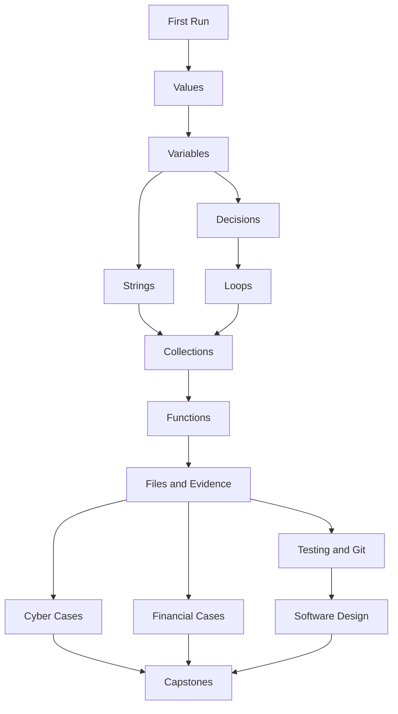

# Interactivity, Fun, and Humane Gamification

## 1. Reanalysis

The original plan was strong on pedagogy and architecture, but a platform can follow sound principles and still feel like homework wearing a neon jacket.

The revised position is:

> Fun is not a reward layer placed after the lesson. Fun is the felt experience of curiosity, control, visible consequence, appropriately difficult discovery, and growing capability.

The platform should make the learner want to touch the system, test an idea, and see what happens. It should preserve the seriousness of becoming technically capable while allowing the experience to sparkle.

## 2. Audience and tone

The initial learner is college-aged. The product must avoid two cliffs:

- **sterile textbook mode:** dense prose, gray exercises, and bureaucratic progress;
- **children’s-game mode:** mascot overload, baby language, fake urgency, and meaningless coins.

The target is a polished investigation simulator with wit, atmosphere, and emotional intelligence. Think “interactive case lab,” not “worksheet with confetti.”

Tone progression can mature with the learner:

```text
Welcoming explorer
    → capable investigator
    → professional analyst
    → independent engineer
```

## 3. Five layers of fun

### 3.1 Intrinsic fun: making the machine respond

The first pleasure of programming is causal power:

```text
I changed this
      ↓
The computer did that
```

The editor, console, and visualizer must respond quickly. Latency drains curiosity.

### 3.2 Discovery fun: resolving uncertainty

Prediction creates a tiny mystery. Debugging creates a larger one. The platform should regularly create answerable questions:

- Which line runs next?
- Why did this value change?
- Which record triggered the alert?
- What assumption breaks on empty input?
- Can two different solutions pass the same tests?

### 3.3 Expressive fun: making it hers

Learners should be able to personalize output, choose mission flavor, name artifacts, select data themes, and occasionally solve a goal in more than one valid way.

### 3.4 Narrative fun: purpose and consequence

Narrative should compress context and supply a reason to care. It must not bury the concept under lore.

A good narrative frame:

> Three badge scans were rejected after midnight. Write a rule that identifies which ones need review.

A bad narrative frame:

> Read six paragraphs about a fictional agency before learning a Boolean comparison.

### 3.5 Social fun: being seen without being ranked

Optional social features can include:

- a parent or mentor checkride;
- pair-debugging missions;
- sharing a finished artifact;
- comparing two solution strategies; and
- celebrating a clear explanation.

Public leaderboards are excluded from the first product because speed and point accumulation can distort learning and discourage beginners.

## 4. Interaction grammar

The platform needs a reusable vocabulary of interactions. Each interaction exists for a learning purpose.

| Interaction | Learner action | Primary purpose | Fun texture |
|---|---|---|---|
| First run | Press Run and observe | Establish causality and orientation | Immediate awakening |
| Personalize | Change names, text, or values | Ownership and syntax familiarity | Expression |
| Predict output | Commit to what happens next | Retrieval and mental simulation | Tiny wager with reality |
| Execution scrubber | Step forward and backward | Build state and control-flow models | Time travel |
| Value map | Watch names, objects, and references change | Make invisible state visible | Living diagram |
| Code ordering | Arrange shuffled blocks | Scaffold program structure | Logic puzzle |
| Fill the gap | Supply one expression or line | Faded example | Satisfying completion |
| Bug hunt | Mark the suspicious line before editing | Diagnostic discipline | Detective work |
| Repair mission | Fix a plausible misconception | Debugging and feedback use | Restoration |
| Constraint twist | Handle an empty, malformed, or surprising input | Robustness and transfer | Plot twist |
| Build mission | Write from requirements and tests | Independent generation | Creation |
| Teach-back | Explain or annotate why it works | Self-explanation and metacognition | Ownership of insight |
| Compare solutions | Inspect two valid approaches | Design judgment and flexibility | Strategic debate |
| Checkride | Solve without live hints | Mastery evidence | Earned tension |
| Case file | Analyze synthetic evidence and report findings | Authentic synthesis | Investigation |

A lesson should vary interactions. Repeating the same fill-in-the-blank shell becomes a slot machine with no jackpot.

## 5. Action-density rule

During active instruction, the learner should rarely go longer than 30 to 90 seconds without a meaningful action.

Meaningful actions include prediction, selection, editing, execution, inspection, explanation, or route choice. Clicking Next after reading is navigation, not meaningful action.

Video is segmented by interaction:

```text
30–120 seconds of explanation
            ↓
pause and predict
            ↓
run or manipulate
            ↓
explain the result
```

## 6. The game world

The working structure is an investigation flight deck:

- **Capability Map:** the curriculum represented as connected systems rather than a flat chapter list.
- **Briefings:** concise concept introductions.
- **Simulator:** safe code execution and visualization.
- **Missions:** bounded practice with a purpose.
- **Case Files:** multi-step domain projects.
- **Debriefs:** explanation and reflection.
- **Checkrides:** independent mastery demonstrations.
- **Field Work:** local tools, GitHub, and open projects.

The theme is replaceable. The underlying learning states and interactions are not.

## 7. Capability map instead of a progress bar

A progress bar implies that time spent moving right equals expertise. The capability map shows what the learner can currently demonstrate.



Nodes show evidence states:

- dim: not yet introduced;
- outlined: introduced;
- half-lit: guided;
- solid: independent;
- ringed: durable after delay;
- connected glow: transferred into another context.

Color is never the only indicator.

## 8. Rewards that preserve meaning

### Capability badges

A badge names a demonstrated behavior, not an attendance event:

- **Prediction Pilot:** accurately predicts multi-line execution across varied examples.
- **State Tracker:** traces changing variables through a loop.
- **Bug Cartographer:** identifies and explains a recurring defect pattern.
- **Evidence Cleaner:** normalizes malformed records with tests.
- **Independent Builder:** completes a bounded project without solution hints.

Every badge opens to its evidence. It can be lost only if the underlying definition changes, not because the learner took a break.

### Unlocks

Unlocks should provide meaningful possibility:

- a new case flavor;
- a harder optional variant;
- an “under the hood” visualization;
- a project dataset;
- a new professional tool; or
- a cosmetic theme that does not affect learning access.

Core learning is never paywalled by points or randomness.

### Artifacts

The best reward is something made:

- a working program;
- a case report;
- a visualization;
- a passing test suite;
- a Git commit;
- a clear README; or
- a before-and-after code comparison.

The portfolio becomes a cabinet of evidence rather than a trophy shelf of icons.

## 9. Streakless momentum

Daily streaks can motivate some people, but they can also turn a missed day into abandonment. The default system uses **momentum without punishment**:

- show recent learning rhythm;
- suggest a manageable next session;
- celebrate return after absence;
- preserve all progress;
- offer a two-minute re-entry mission; and
- never use flames, broken chains, or guilt copy.

An optional personal routine tracker may exist later, but it cannot control content access or mastery.

## 10. Challenge calibration

The platform maintains an estimate of the learner’s state for each skill and the current session.

### Learner states

| State | Evidence | Response |
|---|---|---|
| Cruising | Correct with modest thought | Continue current ladder |
| Bored | Immediate repeated success; requests more challenge | Fade support; increase variation |
| Productively stuck | One or two thoughtful failures with changing hypothesis | Allow space; offer a small nudge |
| Random-walk stuck | Rapid edits with no stable hypothesis | Ask expectation; show state discrepancy |
| Overloaded | Many new elements; long stall; self-report | Reduce visible scope; return to worked model |
| Dependent | Opens solutions before attempts; copies without explanation | Require a fresh parallel task; adjust tutor behavior |
| Frustrated | Repeated failure and negative self-report | Restore control, explain directly, create a small win |

The learner can correct the system’s guess with a one-tap state control:

```text
Too easy | Good challenge | I’m stuck | I’m lost
```

## 11. The hint economy

Hints are not purchased with points and do not create shame. They change the strength of mastery evidence.

A learner who solves with a level-three hint still made progress. The system records “guided” rather than pretending the performance was independent.

Hints should be satisfying because they reveal structure, not because they drip-feed syntax:

1. clarify the goal;
2. expose expected versus observed state;
3. name the relevant concept;
4. provide a diagram or pseudocode;
5. provide one partial line;
6. show and explain the solution;
7. immediately offer a parallel repair.

## 12. First mission specimen: First Contact

### Scene

The console is offline. One line can bring it online.

### Sequence

1. Run `print("Hello, Sophia!")`.
2. Change the message.
3. Predict two-line output.
4. Scrub through both calls.
5. Remove a quote on purpose.
6. Inspect the error clue.
7. Repair it.
8. Add an `investigator` variable.
9. Complete a two-line case banner.
10. Explain what `print` did and what the variable changed.

### Fun beats

- immediate console response;
- the learner’s own message appears;
- the execution beam moves from code to output;
- the error is framed as a solvable clue;
- a tiny “case opened” artifact appears;
- the capability map reveals the next two choices.

### Learning evidence

- run orientation;
- valid edit;
- output prediction;
- syntax-error repair;
- name/value association;
- plain-language explanation.

The celebration lasts seconds. The understanding remains visible.

## 13. Mission design recipe

A compelling mission combines:

```text
One clear capability target
+ one concrete problem
+ one uncertainty to resolve
+ one visible state change
+ one learner choice
+ one recoverable surprise
+ one independent act
+ one artifact or conclusion
```

Narrative is cut until it helps the learner understand the data, goal, or consequence.

## 14. Cyber and financial case design

Authentic context must arrive in layers.

### Early

- compare a purchase with a review limit;
- count failed logins;
- label an access event;
- format a case identifier.

### Middle

- normalize vendor names;
- parse authentication logs;
- group records by user or IP;
- detect duplicates;
- validate dates and amounts.

### Advanced

- correlate identity across datasets;
- build reproducible anomaly pipelines;
- design false-positive controls;
- produce evidence reports;
- evaluate performance and uncertainty.

The platform never implies that an anomaly proves fraud or malicious intent.

## 15. Surprise without manipulation

Small discoveries can reward curiosity:

- an alternate output easter egg after a thoughtful experiment;
- an optional “why Python behaves this way” panel;
- a hidden edge case uncovered by good tests;
- a visual transformation when a cleaner design is found;
- a historical note attached to a concept; or
- a second valid solution path.

There are no randomized loot systems, variable-ratio reward traps, artificial scarcity, or countdown pressure.

## 16. Sound and motion

Use sound and motion sparingly:

- subtle execution tick or success tone, optional and muted by default after onboarding;
- line-to-state animation when it explains causality;
- reduced-motion mode;
- no full-screen celebration after routine tasks;
- no sound for errors that resembles an alarm; and
- no animation that delays the next action.

## 17. Humor

Humor should emerge from the situation and error messages, never from mocking the learner.

Examples:

- “Python reached the end of the line still holding one unmatched quotation mark.”
- “This loop has excellent stamina and no exit plan.”
- “The dictionary was recreated every lap, a tiny memory wipe with impeccable punctuality.”

Humor disappears during high frustration or serious assessment.

## 18. Measuring fun honestly

Track both stated experience and behavior:

- voluntary continuation at a natural stop;
- return rate without streak pressure;
- interaction abandonment points;
- retries after errors;
- experimentation beyond the minimum;
- mission-flavor choices;
- “too easy / good / stuck / lost” signals;
- brief delight and frustration ratings;
- interview recall of memorable moments; and
- whether enjoyment coexists with delayed learning.

A mechanic fails if it increases clicks but decreases reflection, independence, or transfer.

## 19. Playtest questions

- Did the learner understand the goal without a verbal rescue?
- Did the story make the code matter or simply add reading?
- Did she predict thoughtfully or click a guess to continue?
- Was the visualizer inspected voluntarily?
- Did the error invite investigation?
- Did hints preserve agency?
- Was the celebration proportional?
- Did she experiment after succeeding?
- Which moment produced visible satisfaction?
- Would she choose another mission now?
- What did she remember several days later?

## 20. Acceptance bar for a game mechanic

A new mechanic is accepted only when its proposal names:

1. the target learner behavior;
2. the motivational mechanism;
3. the learning mechanism;
4. the risk of distortion;
5. accessibility considerations;
6. immediate success evidence;
7. delayed learning evidence; and
8. a removal condition.

The platform is allowed to be delightful. It is not allowed to counterfeit progress.
