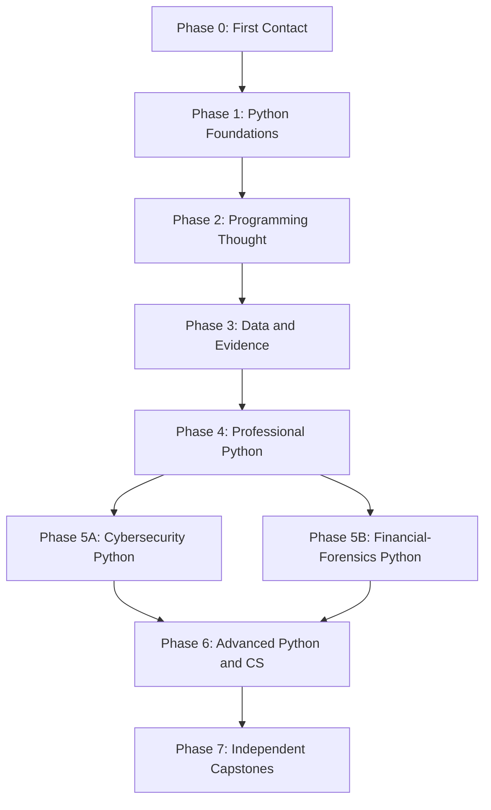

# Zero-to-Advanced Curriculum Map

## 1. Curriculum promise

The curriculum begins before “Hello, World” and continues beyond syntax into professional independence.

It must:

- assume no editor, terminal, file, or programming knowledge;
- introduce every required mental model before relying on it;
- alternate explanation, prediction, tracing, debugging, construction, and transfer;
- revisit important concepts after delays;
- connect foundations to authentic cyber and financial-forensics work without overwhelming the beginner;
- teach reading and debugging code alongside writing it;
- introduce tests, Git, documentation, and design before bad habits harden; and
- gradually move work from the guided browser into professional local tools.

This map defines capability and sequence. Exact lesson counts and pacing remain subject to pilot evidence.

## 2. Curriculum spine



The domain tracks may begin as small flavor choices in earlier phases, but specialized complexity arrives only after the underlying programming ideas are stable.

## 3. Cross-cutting threads

These are not separate chapters saved for later. They grow through every phase.

### Execution models

What Python reads, evaluates, stores, calls, returns, mutates, raises, imports, schedules, and releases.

### Debugging

Prediction, observation, isolation, hypothesis, experiment, repair, and regression test.

### Problem decomposition

Translate a vague goal into inputs, outputs, examples, edge cases, steps, functions, and tests.

### Reading code

Trace unfamiliar programs, summarize intent, identify contracts, and compare implementations.

### Testing and evidence

Move from manual examples to assertions, unit tests, edge cases, fixtures, integration tests, and reproducibility.

### Communication

Names, comments, docstrings, READMEs, findings, uncertainty, and technical explanation.

### Security and ethics

Input validation, secrets, least privilege, safe parsing, controlled datasets, authorization, privacy, false positives, and limits of inference.

### Professional independence

Files, terminal, virtual environments, package management, Git, pull requests, issue tracking, debugging tools, and documentation.

## 4. Phase 0: First Contact

**Learner state:** has never written code or cannot yet explain what code execution means.  
**Purpose:** establish orientation, causal confidence, safe experimentation, and the first accurate mental models.  
**Typical scale:** 15–25 compact lessons plus retrieval and one synthesis mission.

### Units

1. The code area, Run control, and console.
2. `print()` as an instruction with an argument.
3. Text values and quotation marks.
4. Numbers and basic arithmetic.
5. Execution order from top to bottom.
6. Intentional syntax errors and matching punctuation.
7. Names and values: first variables.
8. Reusing and changing a variable.
9. Combining text and values safely.
10. Asking for input.
11. Types as different kinds of values.
12. Converting between text and numbers.
13. Comparisons that produce `True` or `False`.
14. First `if` decision.
15. `if` and `else` paths.
16. Indentation as program structure.
17. Repeating a tiny action with a `for` loop.
18. Reading one simple traceback.
19. Turning a requirement into two or three steps.
20. First synthesis mission.

### Sample missions

- **First Contact:** print and personalize a case banner.
- **Access Badge:** store a name and clearance label.
- **Purchase Review:** compare an amount with a threshold.
- **Signal Counter:** repeat a message a chosen number of times.
- **Case 001:** ask for an investigator name and amount, then print a review decision.

### Exit criteria

Without live solution hints, the learner can:

- distinguish code from output;
- run, edit, and repair a tiny program;
- predict simple top-to-bottom execution;
- use string, numeric, and Boolean values;
- create and update a variable;
- request and convert simple input;
- write a basic conditional;
- use a small counted loop;
- interpret one common syntax or type error; and
- explain what changed in the computer’s state.

No learner is pushed forward solely because Phase 0 content was viewed.

## 5. Phase 1: Python Foundations

**Purpose:** build reliable fluency with control flow, core data structures, functions, and ordinary errors.

### Units

- expressions and operator precedence;
- strings, indexing, slicing, and common methods;
- lists and mutation;
- tuples and unpacking;
- dictionaries and key/value modeling;
- sets and uniqueness;
- `for` and `while` loops;
- nested control flow;
- `break`, `continue`, and loop design;
- functions, parameters, arguments, and return values;
- local scope and name resolution;
- default and keyword arguments;
- simple comprehensions after equivalent loops are understood;
- exceptions and defensive conversion;
- reading built-in documentation; and
- basic assertions.

### Pattern library

The learner repeatedly recognizes and creates:

- accumulator;
- counter;
- search;
- filter;
- transform;
- frequency table;
- running best;
- validation gate;
- sentinel loop;
- lookup table; and
- decomposition into helper functions.

### Projects

- password-policy explainer;
- expense splitter;
- failed-login counter;
- repeated-vendor detector;
- simple menu-driven case notebook; and
- text evidence summarizer.

### Exit criteria

The learner can independently solve bounded problems using loops, collections, and functions; choose a reasonable structure; handle common edge cases; and explain state changes and return values.

## 6. Phase 2: Programming Thought

**Purpose:** turn syntax knowledge into systematic problem solving.

### Units

- define inputs, outputs, constraints, and examples;
- write pseudocode and contracts;
- decompose problems into functions;
- trace data across function calls;
- distinguish pure computation from input/output;
- design and name intermediate representations;
- use tests to drive small changes;
- isolate defects with minimal examples;
- refactor without changing behavior;
- compare clarity, complexity, and robustness;
- reason about empty, malformed, duplicate, and boundary inputs;
- read unfamiliar small programs; and
- use a debugger and breakpoints.

### Debugging curriculum

Debugging is taught as a loop:

```text
Expected behavior
      ↓
Observed behavior
      ↓
Smallest discrepancy
      ↓
Hypothesis
      ↓
Controlled experiment
      ↓
Repair
      ↓
Regression test
```

### Projects

- rules engine for suspicious events;
- configurable text parser;
- case-record validator;
- small command-line quiz with tests; and
- “mystery bug” investigation containing several realistic defects.

### Exit criteria

The learner can start from a short specification, design a solution, implement it in functions, test edge cases, diagnose defects, and improve the structure without step-by-step instructions.

## 7. Phase 3: Data and Evidence

**Purpose:** make Python useful on realistic files and records.

### Units

- filesystem concepts and paths;
- reading and writing text files;
- context managers;
- CSV structure and parsing;
- JSON objects and arrays;
- date, time, timezone, and duration basics;
- regular expressions after string operations are understood;
- robust parsing and data normalization;
- exception handling and error reporting;
- iterating large files;
- basic data provenance;
- reproducible transformations;
- introductory pandas after native Python data handling;
- introductory visualization; and
- communicating findings and uncertainty.

### Projects

- authentication-log parser;
- transaction normalizer;
- duplicate invoice detector;
- timeline generator;
- vendor-name cleaner;
- indicator extractor; and
- evidence-quality report.

### Exit criteria

The learner can ingest a small unfamiliar dataset, inspect its shape, clean common defects, transform it reproducibly, test the transformation, and produce a qualified summary.

## 8. Phase 4: Professional Python

**Purpose:** bridge from a single guided script to maintainable software and collaborative practice.

### Units

- terminal fundamentals;
- files, folders, and project roots;
- local Python installation and version checks;
- virtual environments;
- packages and dependency management;
- modules and imports;
- project layouts and `pyproject.toml`;
- Git concepts, commits, branches, and merges;
- GitHub issues and pull requests;
- `pytest`, fixtures, parametrization, and coverage concepts;
- type hints and static checking;
- logging and observability;
- command-line interfaces;
- environment variables and secrets;
- HTTP and API clients;
- SQL and relational thinking;
- configuration;
- documentation and README design;
- refactoring and code review; and
- packaging and release basics.

### Progressive project shape

```text
single_script.py
      ↓
script + tests
      ↓
multiple modules
      ↓
installable package
      ↓
CLI + configuration + logs
      ↓
GitHub repository + pull-request review
```

### Exit criteria

The learner can create a local project, isolate dependencies, organize modules, use Git, write and run tests, consume an API or database, protect secrets, document setup, and respond to code review.

## 9. Phase 5A: Cybersecurity Python

**Purpose:** apply Python to defensive, authorized, and ethically framed security analysis.

### Units

- log formats and event schemas;
- authentication and access analysis;
- hashes and integrity verification;
- IP addresses, domains, URLs, and indicators;
- safe network metadata analysis;
- threat-intelligence API normalization;
- detection-rule prototyping;
- file metadata and controlled static analysis;
- secure input handling;
- dependency and secret hygiene;
- incident timelines;
- false positives and confidence;
- defensive automation; and
- security reporting.

### Projects

- failed-authentication analyzer;
- indicator-of-compromise extractor;
- file-integrity monitor;
- DNS metadata summarizer;
- threat-intelligence normalizer;
- suspicious event correlator; and
- incident timeline generator.

### Safety boundary

Exercises use synthetic, public, or explicitly authorized data. Offensive concepts are taught only where needed for defensive understanding and inside controlled environments. The platform does not provide live targets, stolen credentials, uncontrolled malware, or instructions for unauthorized access.

## 10. Phase 5B: Financial-Forensics Python

**Purpose:** apply Python to transactions, accounting evidence, anomaly screening, and reproducible investigative analysis.

### Units

- monetary data and decimal precision;
- transaction schemas;
- normalization of dates, amounts, vendors, and identifiers;
- duplicates and near-duplicates;
- grouping, aggregation, and reconciliation;
- journal-entry screening;
- invoice and sequence analysis;
- round-dollar and timing patterns;
- related entities and relationship graphs;
- statistical screening;
- sampling;
- reproducible notebooks and reports;
- evidentiary limits; and
- privacy and handling of sensitive financial data.

### Projects

- duplicate-payment detector;
- expense reimbursement reviewer;
- vendor-normalization pipeline;
- invoice-number gap analyzer;
- accounts-receivable aging report;
- journal-entry red-flag screener;
- related-party relationship map; and
- transaction investigation notebook.

### Interpretation boundary

The curriculum repeatedly distinguishes screening from proof. A pattern, outlier, or Benford-style result may justify review, not a conclusion of fraud.

## 11. Phase 6: Advanced Python and Computer Science

**Purpose:** develop language depth, performance judgment, architectural reasoning, and the ability to learn unfamiliar systems.

### Language depth

- classes, dataclasses, properties, and protocols;
- composition and inheritance tradeoffs;
- dunder methods and Python’s data model;
- iterables, iterators, and generators;
- closures and decorators;
- context managers;
- type variables, generics, and structural typing;
- asynchronous programming;
- threads, processes, and concurrency tradeoffs;
- serialization;
- introspection;
- memory behavior and profiling;
- performance measurement;
- packaging and plugin designs; and
- selected metaprogramming concepts.

### Computer science

- arrays, linked structures, stacks, queues, heaps, trees, and graphs;
- search and sorting;
- recursion and iteration;
- hashing;
- algorithmic complexity;
- graph traversal;
- dynamic programming foundations;
- parsing basics;
- state machines;
- concurrency models; and
- distributed-system fundamentals.

### Software design

- cohesion and coupling;
- interfaces and boundaries;
- dependency direction;
- functional core and imperative shell;
- domain modeling;
- error models;
- observability;
- security design;
- architecture decision records;
- performance tradeoffs; and
- maintainability under change.

### Exit criteria

The learner can choose and justify advanced constructs, diagnose performance or design problems, read unfamiliar library code, and build a nontrivial system with explicit tradeoffs.

## 12. Phase 7: Independent Capstones

Capstones have incomplete information, multiple valid designs, evidence ambiguity, and professional deliverables.

### Capstone 1: Insider Threat Ledger

Synthetic evidence includes:

- login events;
- badge access;
- file access;
- card transactions;
- vendor records; and
- employee identities.

The learner must clean, correlate, test, rank, visualize, and report findings without overstating certainty.

### Capstone 2: Defensive Investigation Toolkit

Build an installable Python package and CLI that ingests selected event formats, validates records, produces summaries, logs errors, and exports a reproducible report.

### Capstone 3: Financial Evidence Pipeline

Build a tested pipeline that normalizes transaction data, identifies candidate duplicates or anomalies, records rule explanations, and generates an auditable notebook or report.

### Capstone requirements

- written scope and assumptions;
- issue breakdown;
- Git history;
- tests;
- handling of malformed inputs;
- documentation;
- privacy and security analysis;
- performance discussion where relevant;
- limitations and false-positive analysis;
- code review response; and
- a short oral or written defense.

## 13. Capability ranks

Ranks summarize breadth of demonstrated capability without replacing the evidence ledger.

| Rank | Meaning |
|---|---|
| Explorer | Can run, modify, and explain small programs |
| Builder | Can create bounded solutions with core Python |
| Investigator | Can debug and analyze realistic files and records |
| Analyst-Engineer | Can build tested multi-file tools with professional workflows |
| Advanced Engineer | Can reason about design, performance, concurrency, and architecture |
| Independent Practitioner | Can solve open problems outside the platform and learn new tools |

Names are working language and should be tested with learners.

## 14. Class-sync mode

Because the first learner is taking a college Python course, the platform should allow her to identify current topics without uploading graded assignments.

Class-sync mode can:

- prioritize prerequisite refreshers;
- offer parallel examples using different data and wording;
- create practice checkrides;
- explain errors in her own attempted code;
- schedule review before exams; and
- map course topics onto the capability graph.

It must not silently generate complete answers to active graded work.

## 15. Placement and skipping

A diagnostic can reduce redundant instruction but must distinguish recognition from independent capability.

To skip a unit, the learner demonstrates a compact sample of:

- prediction or tracing;
- independent generation;
- edge-case reasoning; and
- transfer.

Skipped material remains available. A later misconception can reopen a prerequisite without resetting visible identity or progress.

## 16. Portfolio ladder

```text
Tiny personalized script
  → tested function
  → multi-function case
  → file-based analyzer
  → notebook investigation
  → multi-module CLI
  → API/database application
  → domain toolkit
  → independent capstone
```

Every major artifact includes a readable summary of what the learner can now do that she could not do before.

## 17. Curriculum quality gate

A unit cannot enter the build backlog until it defines:

- prerequisite skills;
- learner-facing objective;
- mental model;
- likely misconceptions;
- worked and faded sequence;
- independent evidence;
- delayed retrieval item;
- transfer task;
- accessibility needs;
- domain and safety considerations; and
- exit criteria.
