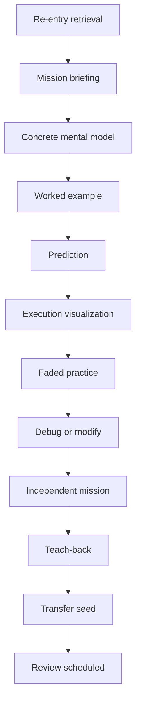

# Lesson Design System

## 1. Purpose

This document turns the product philosophy into a repeatable content-production system. A lesson is a designed sequence of learner decisions and observable state changes, not a formatted article.

The system must support absolute beginners without trapping advanced learners in excessive guidance.

## 2. Lesson contract

Every lesson answers:

1. What can the learner do afterward?
2. What prior capability does it depend on?
3. What mental model makes the syntax meaningful?
4. Which misconceptions are likely?
5. What will the learner actively do?
6. How will support fade?
7. What counts as independent evidence?
8. How will the concept return later?
9. How will the learner apply it in a changed context?
10. What could make this lesson inaccessible, boring, or overwhelming?

## 3. Objective format

Objectives describe observable behavior, conditions, and quality.

Weak:

> Understand dictionaries.

Strong:

> Given a list of repeated identifiers, create a dictionary frequency table, explain why initialization occurs before the loop, and handle empty input without live solution hints.

A lesson normally targets one primary capability and no more than two supporting capabilities.

## 4. Default lesson anatomy

A typical active lesson takes 15 to 25 minutes.



Not every micro-lesson uses every block, but important skills receive the full ladder across their sequence.

## 5. Interaction blocks

### `retrieval`

Recall prior syntax, output, state, strategy, or edge case before reopening support.

### `briefing`

State the problem, data, and goal in under roughly 100 words unless the reading itself is part of the skill.

### `concept-card`

One visual or compact explanation of the new model. Avoid encyclopedic coverage.

### `worked-example`

A complete solution with synchronized explanation. Ask the learner to inspect or predict selected steps.

### `predict-output`

The learner commits to exact output, next line, state, or error class before execution.

### `trace`

The learner steps through execution or fills state values at selected checkpoints.

### `parsons`

The learner orders code blocks. Distractors represent known misconceptions only when feedback can explain them.

### `fill-gap`

A worked example has one or more strategically removed expressions or lines.

### `modify-code`

A valid program must satisfy a changed requirement.

### `bug-hunt`

The learner identifies the likely defect location or broken assumption before editing.

### `repair`

The learner fixes behavior and runs regression tests.

### `write-code`

The learner creates a solution from requirements and tests with bounded scope.

### `explain`

The learner justifies a specific state change, decision, or edge case.

### `compare`

The learner evaluates two or more valid approaches.

### `transfer`

The same underlying structure appears in a changed domain or representation.

### `checkride`

Hints are withheld until submission to produce mastery evidence. The learner can exit without penalty.

## 6. The example-to-independence ladder

For each important pattern, content authors design a sequence such as:

| Rung | Support | Example task |
|---|---|---|
| 1. Observe | Full code and explanation | Watch a counter change |
| 2. Predict | Full code, hidden result | Predict the third iteration |
| 3. Complete | One step removed | Supply the update expression |
| 4. Arrange | Correct blocks shuffled | Order initialization, loop, update, output |
| 5. Diagnose | Plausible bug provided | Find state reset inside loop |
| 6. Modify | Working code, new requirement | Ignore successful logins |
| 7. Generate | Requirements and tests | Write the counter function |
| 8. Transfer | New surface and domain | Count repeated vendors |
| 9. Retrieve | Time has passed | Recreate the pattern later |

A lesson sequence that stops at rung three trains completion, not programming.

## 7. Mental-model design

The first model should be useful and simple, but not knowingly false in a way that becomes expensive later.

### Example: variables

Early language:

> A name lets the program refer to a value.

Visual:

```text
investigator ─────→ "Sophia"
case_number ──────→ 101
```

Later refinement:

- multiple names can refer to the same object;
- some objects can change;
- assignment changes a name’s reference;
- mutation changes an object;
- scope controls where a name is available.

Avoid permanently teaching “a variable is a box containing a value” without refinement.

## 8. Code-example rules

- Use valid, idiomatic Python appropriate to the learner’s current phase.
- Keep the visible region focused on the target concept.
- Do not introduce unexplained syntax as decoration.
- Use meaningful names that reveal domain intent.
- Keep early line lengths modest.
- Show exact output.
- Include empty, boundary, and malformed examples when appropriate.
- Do not hide side effects.
- Separate input/output from computation once functions are introduced.
- Prefer deterministic examples unless randomness is the lesson.
- Never use real secrets, credentials, private financial records, or live targets.

## 9. Example-data rules

Early datasets should fit on the screen and be mentally traceable.

```python
login_results = ["failed", "success", "failed"]
```

Scale grows only when scale itself creates the problem being taught.

Domain data must include a short data dictionary and clearly distinguish synthetic evidence from real records.

## 10. Misconception design

Every lesson lists likely misconceptions and observable signatures.

Example for counters:

| Misconception | Observable signature | Targeted feedback |
|---|---|---|
| Reset inside loop | Final count is 0 or 1 | Visualize state being recreated each iteration |
| Replace instead of accumulate | Total equals last value | Compare assignment with update |
| Wrong condition | Counts all records | Trace one success and one failure |
| Missing default key | `KeyError` on first occurrence | Show absent-key lookup and initialization |

A generic failure message is a lost teaching opportunity.

## 11. Prediction design

Predictions should be close enough to current knowledge to be reasoned about.

Ask for:

- exact output;
- next executed line;
- changed variable;
- number of loop iterations;
- whether an error occurs;
- object identity or mutation at advanced levels; or
- which test fails.

Do not turn prediction into a guessing toll. Always explain the result and allow “I’m not sure” as informative data.

## 12. Execution visualization

A lesson specifies which state is pedagogically relevant. The visualizer should not dump every interpreter detail.

Possible views:

- current line;
- evaluation order;
- names and values;
- object references;
- list and dictionary mutation;
- call stack;
- return values;
- exceptions and propagation;
- iterator state;
- async task state; and
- memory or performance summaries at advanced levels.

Each visual has a text equivalent and keyboard controls.

## 13. Error and feedback writing

Feedback format:

```text
Target
Observed
Likely idea to inspect
Smallest next action
```

Example:

```text
Target: add each suspicious amount to one running total.
Observed: total becomes the current amount on every iteration.
Inspect: the difference between `=` and `+=` here.
Next: predict the total after the second iteration before editing.
```

Avoid:

- “Wrong.”
- “Almost!” without information.
- identity praise.
- a wall of possible causes.
- immediate full replacement code.

## 14. Hint design

Hints are authored as a ladder, not generated ad hoc.

1. Goal clarification.
2. Relevant observation.
3. Concept reminder.
4. Diagram or pseudocode.
5. Partial syntax.
6. Explained solution.
7. Parallel follow-up.

An AI tutor may phrase or select hints, but deterministic lesson metadata defines allowed reveal levels.

## 15. Video design

Video is used when narration, motion, or live demonstration adds value.

Rules:

- generally two to five minutes per segment;
- one main idea per segment;
- captions and searchable transcript;
- playback speed control;
- no essential information available only in audio;
- learner-controlled pacing;
- synchronized code snapshot;
- pause-and-predict checkpoint;
- immediate interaction afterward; and
- no long talking-head introduction before first action.

Do not produce a large video library before the lesson interactions have been validated.

## 16. Teach-back design

Prompts should be specific:

- Why must this dictionary be created before the loop?
- What does the function promise to return?
- Which input violates the current assumption?
- How did the failing test narrow the search?
- Why might a set be better than a list here?

Responses may be written, spoken and transcribed, or represented through annotation. AI can suggest a rubric result, but important mastery decisions require deterministic evidence or human-reviewable criteria.

## 17. Transfer design

A transfer task changes some combination of:

- names;
- domain;
- data shape;
- representation;
- order of information;
- constraints;
- required output; and
- tool environment.

It preserves the underlying structure.

Example:

```text
Learning case: count failed login IPs
Transfer case: count repeated vendors in transactions
Underlying structure: frequency table
```

Near transfer comes before far transfer.

## 18. Checkrides

A checkride is short, calm, and transparent.

- State the capabilities being checked.
- Withhold live hints until submission.
- Allow scratch execution unless mental tracing is the target.
- Do not add arbitrary speed unless fluency is being studied.
- Report evidence by capability, not a dramatic pass/fail identity.
- Provide review and another route after failure.

## 19. Lesson ending

A lesson ends with:

- one-sentence capability statement;
- learner explanation or reflection;
- artifact or evidence snapshot;
- review expectation;
- a natural stop; and
- one or two meaningful next choices.

It does not autoplay the next lesson by default.

## 20. Content authoring template

```yaml
id: phase.unit.lesson
version: 1
objective: observable learner behavior
prerequisites: []
primary_skill: skill-id
supporting_skills: []
mental_model: concise model
misconceptions: []
interactions: []
independent_evidence: []
delayed_review: []
transfer: []
accessibility: {}
safety: {}
sources: []
```

The canonical machine-readable contract is in `content/schema/lesson.schema.yaml`.

## 21. Quality review checklist

### Learning

- Is the objective observable?
- Are prerequisites actually taught?
- Does the learner act frequently?
- Is there a mental model, not just syntax?
- Does support fade?
- Is independent generation present somewhere in the sequence?
- Is delayed retrieval defined?
- Is transfer defined?

### Fun and motivation

- Is there a clear reason to care?
- Is the uncertainty answerable?
- Does the learner make a meaningful choice?
- Is the feedback satisfying because it reveals cause?
- Is celebration proportional?
- Can the learner stop cleanly?

### Technical

- Do reference solutions pass all tests?
- Do misconception variants fail for the intended reason?
- Are tests deterministic?
- Are trace snapshots bounded and correct?
- Does reset restore starter state?

### Accessibility and safety

- Can the lesson be completed by keyboard?
- Are visuals described in text?
- Are captions/transcripts present?
- Is motion reducible?
- Is color nonessential?
- Is data synthetic or authorized?
- Does the cyber framing remain defensive?
- Does financial interpretation state its limits?

## 22. Publication gate

A lesson is publishable only after:

1. schema validation;
2. test validation;
3. misconception-path validation;
4. accessibility review;
5. instructional review;
6. safety and integrity review;
7. at least one observed learner run; and
8. a recorded revision decision.
