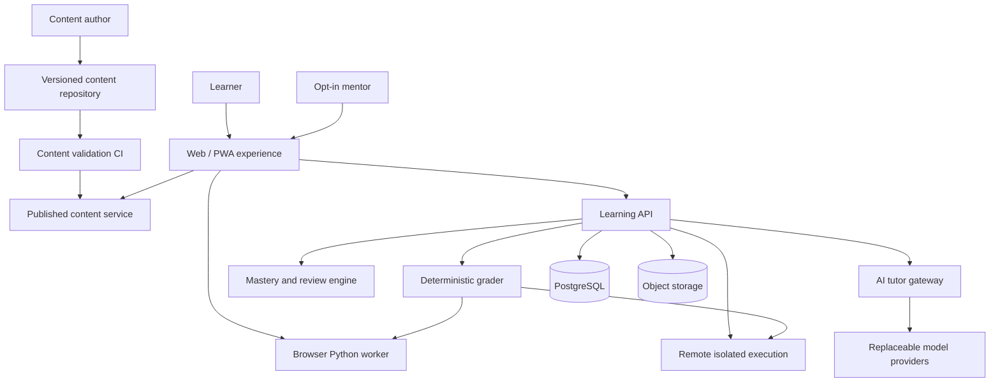
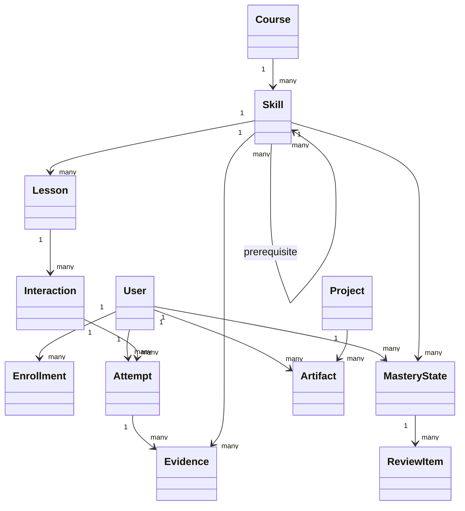

# Technical Architecture

## 1. Architecture goal

Build the smallest system that can deliver and measure the core learning loop:

```text
Predict → Execute → Visualize → Diagnose → Modify → Test → Explain → Revisit
```

The architecture should make high-quality instruction easy to author, deterministic behavior easy to verify, learner data easy to protect, and major infrastructure replaceable.

It should not become a cathedral before the first learner has enjoyed the first five lessons.

## 2. Architectural principles

- **Browser-first, not browser-only.** Early code runs instantly in the browser; advanced work moves into isolated server environments and local professional tools.
- **Deterministic core.** Execution, tests, mastery evidence, and authored hint limits are product authority.
- **AI at the edge of authority.** AI diagnoses, explains, and generates validated practice. It does not define truth.
- **Content as versioned data.** Lessons, tests, hints, misconceptions, and rubrics live in reviewable files.
- **Event-based evidence.** Learning decisions derive from explicit attempts and support conditions.
- **Progressive complexity.** Prototype with one vertical slice; add services only when a demonstrated need appears.
- **Replaceable infrastructure.** Editors, model providers, sandbox vendors, schedulers, and deployment hosts remain behind interfaces.
- **Privacy by design.** Public curriculum and private learner data are physically and logically separated.
- **Secure execution.** Untrusted code never runs in the application server process.
- **Accessible representations.** Every visual execution feature has a semantic text path.

## 3. System context



## 4. Staged architecture

### Stage A: interaction prototype

Goal: validate first-session mechanics.

- one Next.js or React application;
- Monaco or a lighter editor candidate;
- Pyodide in a Web Worker;
- local lesson JSON/YAML;
- deterministic browser tests;
- local-storage-only anonymous progress;
- handcrafted execution snapshots for the first concepts; and
- no production AI or account system.

### Stage B: Sophia pilot MVP

Goal: support multiple sessions, review, tutor, and protected learner progress.

- web application;
- FastAPI learning API;
- PostgreSQL;
- versioned content build;
- browser execution runtime;
- generalized trace capture for supported concepts;
- deterministic grader;
- mastery and review service;
- constrained AI tutor gateway;
- authenticated learner account;
- private event storage; and
- basic author validation CI.

### Stage C: project studio

Goal: support realistic data and professional workflows.

- multi-file workspace;
- object storage for synthetic datasets and artifacts;
- notebook mode;
- remote isolated execution for unsupported packages or OS concepts;
- GitHub export;
- report generation; and
- mentor summaries.

### Stage D: scaled platform

Only after evidence supports broader use:

- multi-tenant authorization;
- content authoring UI if file-based authoring becomes the bottleneck;
- adaptive scheduling model;
- cohort features;
- advanced sandbox orchestration;
- richer analytics;
- localization; and
- operational scaling.

## 5. Proposed monorepo shape

```text
Sophia-Learns-Code/
├── apps/
│   ├── web/                    # learner and author-facing web UI
│   ├── api/                    # FastAPI learning API
│   └── worker/                 # background validation and artifact jobs
├── packages/
│   ├── lesson-schema/          # shared schema and generated types
│   ├── lesson-renderer/        # interaction block renderer
│   ├── execution-runtime/      # browser runner and protocol
│   ├── trace-model/            # normalized execution snapshots
│   ├── grader-contracts/       # tests and result schemas
│   ├── mastery-model/          # evidence state logic
│   ├── tutor-contracts/        # structured tutor I/O
│   └── ui/                     # accessible shared components
├── content/
│   ├── schema/
│   ├── skills/
│   ├── lessons/
│   ├── projects/
│   ├── misconceptions/
│   ├── datasets/
│   └── examples/
├── docs/
├── evals/
│   ├── tutor/
│   ├── grader/
│   └── lessons/
├── infra/
└── .github/
```

This is a target shape, not a requirement for the first prototype.

## 6. Frontend

### Candidate stack

- Next.js and React;
- TypeScript with strict checking;
- accessible component primitives;
- Monaco Editor for desktop professional fidelity;
- SVG/HTML for semantic execution diagrams;
- Web Workers for Python execution;
- service worker or local cache only after the core interaction is stable; and
- a small state machine for lesson flow rather than ad hoc component flags.

### Editor decision

Monaco powers VS Code and provides a professional editing experience. Its official documentation notes that mobile browser support is not its target. Therefore:

- the main coding experience is desktop or laptop first;
- mobile supports review, prediction, trace, video, and progress interactions;
- CodeMirror or another editor may be evaluated for lightweight/mobile cases; and
- the editor is wrapped behind a product interface so it can be replaced.

### Core UI regions

```text
Mission briefing | Code editor | Computer's Mind
--------------------------------------------------
Console / tests / trace timeline
--------------------------------------------------
Coach, hints, notes, and debrief
```

The layout collapses based on concept and screen size. It never shows every panel merely because they exist.

## 7. Browser Python execution

### Runtime

Pyodide is the leading initial candidate because it runs CPython compiled to WebAssembly in the browser and supports many pure-Python and scientific packages.

Run it in a dedicated Web Worker to protect interface responsiveness.

### Execution protocol

```typescript
type RunRequest = {
  requestId: string;
  code: string;
  files?: Record<string, string>;
  stdin?: string[];
  packages?: string[];
  timeoutMs: number;
  traceMode: "none" | "lines" | "state";
};

type RunResult = {
  requestId: string;
  status: "passed" | "failed" | "error" | "timeout" | "cancelled";
  stdout: string;
  stderr: string;
  exception?: NormalizedException;
  trace?: TraceSnapshot[];
  testResults?: TestResult[];
  metrics: {
    durationMs: number;
    snapshotCount: number;
  };
};
```

### Worker lifecycle

- create a worker per active workspace or controlled pool;
- initialize pinned runtime assets;
- apply package allowlist;
- capture stdout and stderr;
- enforce wall-clock and snapshot limits;
- cancel and replace a runaway worker;
- reset namespace between defined tasks; and
- never expose application secrets to the runtime.

Browser WebAssembly is a useful isolation boundary but not a substitute for careful resource limits and API design.

## 8. Execution visualizer

### Goal

Show only the interpreter state needed to build the current mental model.

### Capture approach

For supported beginner and intermediate programs:

- use Python tracing hooks such as `sys.settrace` inside the worker;
- normalize line, call, return, and exception events;
- serialize selected local and global names;
- assign stable object IDs during a run;
- represent references explicitly;
- apply depth, size, and type limits;
- capture stdout progression;
- map snapshots to source lines; and
- permit lesson metadata to select visible names.

AST instrumentation may supplement tracing for expression-level evaluation where line events are insufficient. It must preserve source mapping and semantics and requires a dedicated test suite.

### Normalized snapshot

```json
{
  "step": 7,
  "event": "line",
  "line": 4,
  "frame": {
    "id": "frame-1",
    "function": "<module>",
    "locals": {
      "ip": {"kind": "ref", "objectId": "str-2"},
      "counts": {"kind": "ref", "objectId": "dict-1"}
    }
  },
  "objects": {
    "str-2": {"type": "str", "preview": "10.0.0.8"},
    "dict-1": {
      "type": "dict",
      "entries": [["10.0.0.8", 2]]
    }
  },
  "stdout": ""
}
```

### Safety and performance limits

- maximum steps;
- maximum object depth;
- maximum collection items;
- cycle detection;
- redaction hooks;
- unsupported-object fallback preview;
- snapshot compression; and
- worker termination on limit breach.

### Accessibility

Every snapshot can render as text:

```text
Step 7, line 4.
ip refers to the string "10.0.0.8".
counts refers to a dictionary containing one entry:
"10.0.0.8" maps to 2.
No output has been produced.
```

## 9. Remote execution

Browser execution cannot model every operating-system, package, network, or multi-process concept.

Advanced missions route to ephemeral isolated environments.

### Requirements

- container or microVM isolation;
- immutable base images;
- non-root user;
- CPU, memory, process, disk, and time quotas;
- outbound network disabled by default;
- per-mission network allowlists where justified;
- no cloud credentials in the environment;
- read-only system image;
- ephemeral writable workspace;
- file type and size limits;
- package allowlist or prebuilt environment;
- audit event without storing unnecessary code; and
- destruction after execution.

Judge0 or another sandbox engine may be evaluated, but the product contract must not depend on one vendor.

## 10. Learning API

FastAPI is the initial candidate because the product is Python-centered and benefits from shared schemas and domain familiarity.

Suggested service boundaries in a modular monolith first:

- identity and consent;
- curriculum and content;
- attempts and artifacts;
- grader orchestration;
- mastery and review;
- tutor gateway;
- projects and portfolios; and
- mentor sharing.

Do not split these into network services until scaling, ownership, or security boundaries require it.

## 11. Core domain model



Important entities:

- `User`
- `ConsentRecord`
- `Skill`
- `SkillEdge`
- `LessonVersion`
- `Interaction`
- `Misconception`
- `Attempt`
- `ExecutionResult`
- `Evidence`
- `MasteryState`
- `ReviewItem`
- `Project`
- `Artifact`
- `TutorDecision`
- `ShareGrant`

## 12. Content architecture

Lesson source files contain declarative blocks and references to code, tests, assets, hints, and misconceptions.

Build pipeline:

```text
Author change
   ↓
Schema validation
   ↓
Reference and prerequisite validation
   ↓
Execute starter and reference solutions
   ↓
Run visible, hidden, and misconception tests
   ↓
Accessibility and safety checks
   ↓
Build immutable content bundle
   ↓
Publish version
```

Published attempts always reference an immutable lesson version so later edits do not corrupt historical evidence.

## 13. Deterministic grader

The grader accepts a versioned task contract and execution result.

It may evaluate:

- tests;
- exact or normalized output;
- returned values;
- raised exceptions;
- properties across generated inputs;
- selected AST constraints;
- trace predicates;
- performance bounds; and
- rubric checkpoints.

The grader produces structured evidence and learner-safe feedback codes. It does not author long explanations; the lesson renderer or tutor converts codes into instruction.

## 14. Mastery and review engine

Version 1 is a deterministic state machine using:

- task type;
- novelty;
- support level;
- correctness;
- delay;
- transfer distance;
- misconception evidence; and
- explanation rubric.

Later models may estimate memory stability or knowledge probability, but they must preserve inspectable evidence and be evaluated against the transparent baseline.

## 15. AI tutor gateway

The gateway:

- receives bounded structured context;
- redacts obvious secrets and identifiers;
- applies integrity and cyber-safety policy;
- selects a model by task and privacy tier;
- requests structured output;
- validates the schema;
- cross-checks claims against tests and traces;
- enforces authored hint ceilings;
- logs decision metadata;
- supports deterministic fallback; and
- never exposes provider credentials to learner code.

Tutor prompts and policy versions are code-reviewed and evaluated like application logic.

## 16. Event model

Learning events should be purposeful rather than exhaustive surveillance.

Examples:

```text
lesson_started
prediction_submitted
run_requested
run_completed
test_failed
trace_inspected
hint_opened
misconception_observed
solution_revealed
independent_task_completed
explanation_submitted
review_completed
transfer_completed
session_stopped
```

Each event includes versioned context, support level, and privacy classification.

Avoid collecting raw mouse movement, keystroke streams, or private text unless a validated research purpose, informed consent, and retention policy exist.

## 17. Data stores

### PostgreSQL

- identity references;
- consent;
- curriculum metadata;
- attempts;
- evidence;
- mastery states;
- review queue;
- tutor decisions;
- share grants; and
- operational records.

### Object storage

- synthetic datasets;
- learner project artifacts;
- generated reports;
- videos and transcripts;
- notebook files; and
- large trace bundles when needed.

### Repository

- public product docs;
- schemas;
- lessons and tests safe for publication;
- synthetic fixtures;
- evaluation scenarios without learner data; and
- decision records.

## 18. Authentication and authorization

Start simple but correct:

- learner account;
- optional mentor account;
- explicit learner-created share grants;
- role checks at API boundaries;
- short-lived sessions;
- protected administrative routes;
- audit of consent and sharing changes; and
- deletion/export support.

A mentor cannot access tutor conversations or raw code unless the learner explicitly grants that scope.

## 19. Privacy architecture

- separate direct identity from learning events where practical;
- encrypt data in transit and at rest;
- redact secrets before AI routing;
- define provider data-handling tiers;
- set retention windows;
- allow export and deletion;
- avoid real sensitive case data in lessons;
- prevent analytics from entering the public repository; and
- document every new data field’s learning or operational purpose.

## 20. Security architecture

Threat categories include:

- arbitrary learner code;
- prompt injection through code or datasets;
- secrets pasted into the editor;
- tutor output containing unsafe code;
- malicious lesson content;
- cross-learner data access;
- remote sandbox escape;
- supply-chain compromise;
- unsafe file upload; and
- abuse of cyber exercises.

Controls include:

- strict isolation;
- package and network allowlists;
- content signing or immutable versioning;
- dependency scanning;
- least-privilege credentials;
- structured AI output;
- server-side authorization;
- file validation;
- abuse monitoring; and
- tested incident procedures.

## 21. Performance targets

Initial experience targets:

- first interface interactive quickly on an ordinary student laptop;
- Run feedback should feel immediate for small programs;
- execution worker initializes in the background after page readiness;
- prediction and text interactions work before Python initialization completes;
- cancellation is always available;
- trace stepping remains smooth for bounded snapshots; and
- tutor latency never blocks deterministic feedback.

Exact budgets should be established through prototype measurement rather than guessed into permanence.

## 22. Resilience and offline behavior

The deterministic lesson should remain useful when AI or remote execution is unavailable.

Fallback order:

```text
Browser lesson + browser execution
    → authored hints and feedback
    → cached progress awaiting sync
    → AI tutor when available
    → remote sandbox only when required
```

Selected foundational lessons may become offline-capable after the runtime and content bundle are stable.

## 23. Observability

Operational signals:

- page and runtime initialization;
- run latency and cancellation;
- worker crashes and timeouts;
- trace size;
- grader disagreement;
- tutor schema failures;
- sandbox queue and isolation failures;
- content validation errors; and
- authorization denials.

Learning signals are governed separately and interpreted cautiously.

## 24. Testing strategy

### Unit

- schemas;
- mastery transitions;
- trace normalization;
- grader predicates;
- redaction;
- tutor policy; and
- content validators.

### Property and fuzz

- serializers;
- parser tasks;
- grader input generation;
- trace limits;
- file validation; and
- API contracts.

### Integration

- lesson to runner to grader;
- tutor grounded in a failing test;
- progress sync;
- review scheduling;
- sandbox lifecycle; and
- GitHub export.

### End-to-end

- first run;
- error repair;
- hint ladder;
- return session;
- checkride;
- project artifact; and
- learner-controlled mentor sharing.

### Learning validation

Software tests cannot prove a lesson teaches. Observed learner sessions and delayed performance remain release gates.

## 25. Initial technical spikes

1. Measure Pyodide initialization and run latency on representative laptops.
2. Capture bounded line/state traces for variables, conditionals, loops, lists, dictionaries, and functions.
3. Compare Monaco with a lighter editor for first-session usability and accessibility.
4. Render trace snapshots as synchronized visual and semantic text views.
5. Execute authored tests entirely in the worker.
6. Validate a lesson YAML file into generated TypeScript and Python types.
7. Demonstrate a tutor response grounded in deterministic trace evidence.
8. Threat-model browser and remote execution.

## 26. References and candidates

- Pyodide documentation: https://pyodide.org/en/stable/
- Monaco Editor: https://microsoft.github.io/monaco-editor/
- JupyterLite documentation: https://jupyterlite.readthedocs.io/en/stable/
- Judge0 project: https://judge0.com/

Technology choices are provisional until the spikes and first learner prototype are reviewed.
