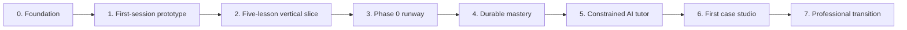

# MVP and Delivery Roadmap

## 1. Strategy

Do not build the entire school before observing the first lesson.

The project should progress through thin, testable vertical slices. Each slice includes content, interaction, execution, feedback, evidence, and a real learner session.

The first product question is:

> Can a complete beginner enjoy and understand the first 30 minutes well enough to continue, while producing genuine evidence of learning?

## 2. Smallest valuable vertical slice

The first runnable slice contains five carefully connected lessons:

1. **First Contact** — run, change, predict, and repair `print()`.
2. **Names and Values** — variables as names referring to values.
3. **Make a Decision** — comparisons and a first `if`.
4. **Repeat the Signal** — a small `for` loop and visible iteration state.
5. **Case 001** — combine input, variables, a decision, and output in a tiny independent mission.

It supports:

- briefing;
- code editor;
- browser execution;
- console;
- exact-output prediction;
- simple line-by-line trace;
- fill-gap or code-ordering interaction;
- one intentional bug repair;
- deterministic tests;
- authored hint ladder;
- debrief;
- local evidence ledger; and
- clean stopping and return.

## 3. Explicit non-goals for the first slice

- account system;
- payments;
- native mobile application;
- broad social features;
- public leaderboard;
- production AI tutor;
- remote code execution;
- notebook environment;
- GitHub export;
- elaborate avatar economy;
- long-form video library;
- full adaptive scheduler;
- hundreds of lessons; and
- offensive-security environment.

A feature can be clever and still be early.

## 4. Delivery gates



Each gate requires a real learner observation and recorded decision.

## 5. Milestone 0: Foundation

### Deliverables

- product charter;
- learner journey;
- learning-science translation;
- interactivity and gamification rules;
- curriculum map;
- lesson design system;
- mastery model;
- AI tutor policy;
- technical architecture;
- risk register;
- first lesson specimen;
- prioritized issues; and
- decision log.

### Exit gate

- documents are internally consistent;
- the first 30-minute experience can be storyboarded end to end;
- every interaction states its learning purpose;
- open decisions and experiments are explicit; and
- no code framework choice is mistaken for learner validation.

## 6. Milestone 1: First-session interaction prototype

### Goal

Validate flow, language, density, and emotional experience before general infrastructure.

### Build

- clickable layout;
- code-looking editor, initially permitted to use scripted outcomes;
- first-run moment;
- prediction card;
- execution-step animation;
- intentional error and repair;
- first variable visualization;
- debrief; and
- capability-map reveal.

### Test

Observe the learner without explaining the interface unless safety or distress requires it.

### Exit gate

- learner finds Run without help;
- distinguishes code and output;
- understands the purpose of prediction;
- repairs the designed error with authored support;
- can explain one state change;
- reports that the tone feels adult and inviting;
- no five-minute interval is dominated by passive consumption; and
- at least one moment produces visible curiosity or experimentation.

## 7. Milestone 2: Five-lesson runnable vertical slice

### Goal

Replace scripted outcomes with real Python and deterministic evidence.

### Build

- browser Python worker;
- editor integration;
- stdout/stderr capture;
- bounded execution trace;
- test runner;
- lesson renderer for core interaction types;
- reset and cancellation;
- authored hints;
- local attempt/evidence store; and
- five complete lesson files.

### Exit gate

- reference solutions and misconception variants are automatically validated;
- no learner code runs on the UI thread;
- runaway code can be cancelled;
- trace accurately represents the five lessons;
- complete beginner finishes the sequence without external technical setup;
- delayed review several days later shows useful retention; and
- design revisions are recorded.

## 8. Milestone 3: Absolute-zero runway

### Goal

Expand the proven design into the complete Phase 0 foundation.

### Build

- approximately 15–25 compact lessons;
- broader interaction grammar;
- strings, numbers, input, types, conditions, indentation, simple loops, and errors;
- multiple mission flavors;
- accessibility settings;
- progress persistence; and
- first synthesis case.

### Exit gate

- a true beginner can reach the Phase 0 exit criteria;
- placement does not allow recognition-only skipping;
- review burden remains manageable;
- content QA catches broken examples and hints;
- accessibility review is complete for supported interactions; and
- several novice testers reveal no common hidden prerequisite left unaddressed.

## 9. Milestone 4: Durable mastery

### Goal

Prove that the product supports remembering and transfer, not only immediate completion.

### Build

- authenticated progress;
- evidence ledger;
- mastery states;
- review queue;
- misconception tracking;
- delayed tasks;
- near-transfer tasks;
- checkrides; and
- learner-visible evidence explanations.

### Exit gate

- state transitions are transparent;
- hints correctly alter evidence classification;
- delayed tasks are scheduled and completed;
- mastery display matches underlying evidence;
- returning after absence feels welcoming rather than punitive; and
- transfer performance is measurable.

## 10. Milestone 5: Constrained AI tutor

### Goal

Add adaptive explanation and debugging without weakening agency.

### Build

- tutor gateway;
- structured context and response schemas;
- Explain, Nudge, and Debug Coach modes;
- deterministic grounding in tests and traces;
- hint-ceiling enforcement;
- direct-explanation option;
- academic-integrity policy;
- privacy redaction;
- cyber-safety policy; and
- tutor evaluation suite.

### Exit gate

- tutor never overrides deterministic results in the evaluation suite;
- responses remain within authored reveal levels;
- full reveals trigger parallel practice;
- likely graded work is handled correctly;
- secret-paste and cyber-safety scenarios pass;
- tutor improves recovery or explanation in observed sessions; and
- the lesson remains usable when the model is unavailable.

## 11. Milestone 6: First investigation studio

### Goal

Combine foundational Python with meaningful evidence work.

### Build

- file and dataset handling;
- multi-step case workflow;
- synthetic cyber and transaction records;
- notebook or report surface;
- artifact storage;
- project rubric;
- mentor-share control; and
- first combined case.

### Exit gate

- learner can explain data provenance and limitations;
- deterministic transformations are reproducible;
- anomaly language does not imply guilt;
- no real sensitive data is required;
- project produces a shareable artifact; and
- learner can repeat key steps outside the guided path.

## 12. Milestone 7: Professional transition

### Goal

Move from platform fluency to engineering fluency.

### Build

- simulated then real terminal guidance;
- local environment setup;
- files and folders;
- virtual environments;
- pytest;
- Git and GitHub workflow;
- project export; and
- local checkride.

### Exit gate

- learner can clone or create a repository;
- run code and tests locally;
- commit and branch;
- diagnose common environment problems;
- submit a reviewed project; and
- complete a task whose execution occurs outside the learning platform.

## 13. Build order inside a slice

For each vertical slice:

```text
1. Define learner outcome and misconception
2. Storyboard interactions
3. Write tests and reference solution
4. Create lesson data
5. Implement minimum renderer/runtime support
6. Validate accessibility and safety
7. Observe learner
8. Measure delayed performance
9. Revise or remove
10. Generalize only after success
```

This avoids building a generic engine for an interaction that does not teach well.

## 14. First technical backlog

### Experience

- storyboard First Contact;
- prototype mission/editor/console/visualizer layout;
- test adult narrative language;
- define reduced-motion and keyboard flows.

### Runtime

- Pyodide worker spike;
- stdout, stderr, timeout, and reset;
- trace snapshots for assignment, print, comparison, `if`, and `for`;
- deterministic browser tests.

### Content

- finalize first five objectives and prerequisites;
- author misconception tables;
- create hint ladders;
- write delayed and transfer items;
- create synthetic case data.

### Evidence

- local attempt format;
- support-level capture;
- simple capability-map states;
- session export for analysis.

## 15. Release gate categories

A milestone cannot advance on engineering completion alone.

### Product

The journey is coherent and the learner understands the interface.

### Pedagogy

Independent, delayed, and transfer evidence exists.

### Delight

The learner experiences curiosity, control, and earned satisfaction.

### Accessibility

Target interactions work through supported equivalent paths.

### Safety and privacy

Execution, AI, data, and sharing boundaries pass review.

### Engineering

Runtime, tests, observability, recovery, and content validation meet the slice’s needs.

## 16. Stop or pivot signals

Pause expansion when:

- learners complete but cannot explain or transfer;
- visualizations attract attention but do not improve state reasoning;
- narrative reading exceeds code interaction;
- hints train answer-seeking;
- AI reduces independent attempts;
- review queues create avoidance;
- architecture work grows faster than learner-tested content;
- content authoring requires excessive custom code; or
- the first learner would rather use a simpler combination of existing tools.

A pivot is evidence of discipline, not failure.

## 17. Definition of MVP

MVP is not “all features in miniature.”

MVP is:

> A complete beginner can enter with no setup, enjoy five connected Python lessons, run and inspect real code, recover from errors, demonstrate the first capabilities independently, and retrieve them after a delay.

Everything else waits outside the airlock.
