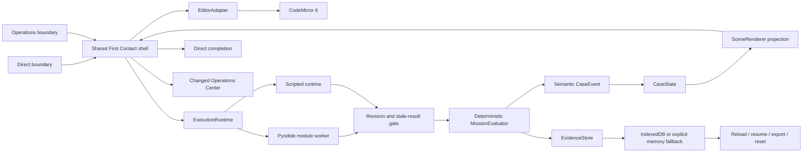

# Issue #26 Mission-Shell Technology Spike

**Status:** complete for human architecture checkpoint; no production decision made

**Prototype classification:** transferable contracts and evidence; disposable implementation

**Governing issue:** #26

**Parent Wayfinder map:** #20

**Related controlled product experiment:** #22

**Exact base SHA:** `c442c5bd6fdbf09c0ac59cf3bc9ae1e3f5ecbe43`

**Exact tested implementation/evidence SHA:** `fcef1c043f6b03b39692de225d29e798b509a315`

**Root-contract SHA:** `f176e8dc36cb0e0c70fd6d96844a3ec9e098c7b1`

**Branch:** `spike/mission-shell-stack`

**Draft PR:** [#30](https://github.com/Rainman147/Sophia-Learns-Code/pull/30)

The exact tested SHA is the commit on which the full verification matrix and final measurements ran. A documentation-only commit follows it; the PR and final handoff record the branch's final head because a commit cannot contain its own SHA.

## Executive result

The spike proves that one browser-only shell can deliver the complete bounded First Contact loop with real Python off the UI thread, deterministic truth, semantic Case consequences, recoverable execution, and local evidence. All 18 required slice behaviors passed. The same Mission runs behind two controlled entry/completion boundaries, and neither product variant is selected here.

The result does **not** justify adopting the implementation unchanged. Pyodide's same-origin payload is 13.53 MB, Firefox cold initialization was 8.53 seconds on the only available (high-end) host, Firefox worker replacement after cancellation was 8.52 seconds, CodeMirror required an explicit Firefox Tab escape, and no physical low-end device or real screen reader was available. Those facts make the browser/Pyodide/editor direction testable and promising, but still `revise` material at the architecture checkpoint.

## Authority and conflict record

The root read the following before implementation:

- `VISION.md`
- `docs/01-learner-journey.md`
- `docs/03-interactivity-and-fun.md`
- `docs/05-lesson-design-system.md`
- `docs/06-mastery-and-assessment.md`
- `docs/08-technical-architecture.md`
- `docs/12-risks-and-guardrails.md`
- `docs/15-platform-stack-and-rust-strategy.md`
- `docs/17-vertical-slice-build-plan.md`
- `docs/18-game-and-narrative-design-system.md`
- `docs/19-experience-identity-and-media-system.md`
- `docs/20-prebuild-architecture-and-research-gates.md`
- `docs/21-project-rebaseline-assessment.md`
- `docs/22-rebaseline-decisions.md`
- `docs/handoffs/CODEX-PREBUILD-EXPERIENCE-REBASELINE.md`
- `docs/handoffs/CODEX-ISSUE-22-EXPERIENCE-LAB-0.md`
- `docs/handoffs/CODEX-ISSUE-26-MISSION-SHELL-SPIKE.md`
- `content/examples/phase-0/001-first-contact.yaml`
- GitHub issues #20, #21, #22, and #26

Meaningful packet conflicts were resolved explicitly:

| Conflict | Controlling resolution in this lane |
|---|---|
| Issue #22 names `prototype/experience-lab-0`; issue #26 and the owner request name `spike/mission-shell-stack` | Use `spike/mission-shell-stack`. |
| Issue #22 isolates under `prototypes/experience-lab-0`; issue #26 and the owner request require `spikes/mission-shell/` | Keep the entire implementation and generated evidence under `spikes/mission-shell/`; only experiment reports live under `docs/experiments/`. |
| Issue #22 forbids Pyodide; issue #26 requires a real worker path | Share the real Pyodide path between both variants and keep `?runtime=scripted` as an explicitly synthetic deterministic test/review path. |
| Issue #22 requests one agent; issue #26 and the owner request require Ultra workstreams | The root established contracts first, then used four disjoint issue #26 workstreams; one root retained architecture and integration ownership. |
| Issue #22 asks for premium visual quality; issue #26 says the spike is not a polished production application | Make both variants coherent enough for an honest owner comparison while declaring the styling, copy, and composition disposable. |

The rebaseline authorities governed over older architectural language. No canonical authority was edited.

## Scope and run instructions

The runnable experiment is self-contained in `spikes/mission-shell/`.

```text
cd spikes/mission-shell
npm ci
npm run dev
```

Review routes:

- Direct Mission: `http://127.0.0.1:3100/direct/`
- Operations Center + Mission: `http://127.0.0.1:3100/operations/`
- Deterministic synthetic review: append `?runtime=scripted`
- Default route behavior: real pinned Pyodide

`predev` and `prebuild` copy the pinned Pyodide distribution and compile the native ESM worker into ignored generated assets. No learner execution uses a server route.

## Implemented architecture



High-frequency interaction is client-side. Python runs only in a replaceable Worker. Correctness comes from `MissionEvaluator`, never from animation or an AI response. Case meaning is a semantic event/state transition before it becomes SVG, text, or motion.

## Root ownership and subagent partition

The root authored the shared contracts and integration rules in `f176e8dc36cb0e0c70fd6d96844a3ec9e098c7b1` before delegation. No subagent edited the root contract files or introduced a competing framework.

| Workstream | Bounded ownership | Integration result |
|---|---|---|
| A — Euclid | Pyodide worker execution, normalization, cancellation, replacement, revision identity, timings | Integrated behind root-owned `ExecutionRuntime`; native-worker build workaround added by root. |
| B — Hypatia | Mission flow and CodeMirror implementation behind `EditorAdapter` | Integrated behind root ports; root repaired stage pacing, scroll restoration, Firefox Tab behavior, and failed-result editability. |
| C — Kepler | Evaluator, `CaseState`, semantic events, scene projection, and `EvidenceStore` | Integrated without React/runtime leakage into domain truth. |
| D — Curie | Test, accessibility, performance, failure, and dependency-ledger scaffolding | Produced bounded scaffolding; the worker ended before a final handoff, so the root inspected, corrected, executed, and owns every final result. |
| Root integrator | Contracts, routes, controller, controlled variants, dependency/build decisions, visual QA, measurements, reports, Git, and PR | One architecture; no overlapping contract edits. |

The detailed integration record is in [`root-integration.md`](../../spikes/mission-shell/notes/root-integration.md).

## Root-owned contracts

| Seam | Risk protected | Minimal implemented contract |
|---|---|---|
| `MissionDefinition` | Framework state changing curriculum meaning | One versioned First Contact specimen with typed tasks, expected evidence, and authored stages. |
| `MissionActor` | Ad hoc component flags creating dead ends | Explicit events, snapshots, stage progression, pause/resume, reset, and stale-result rules. |
| `EditorAdapter` | Mission logic binding to CodeMirror | Source/revision reads and writes, focus, diagnostics, decorations, change subscription, and disposal. |
| `ExecutionRuntime` | Pyodide protocol becoming product truth | Versioned requests/results, lifecycle, output/time limits, cancellation, reset, replacement, status, and metrics. |
| `MissionEvaluator` | UI or animation deciding correctness | Pure task/result evaluation with evidence and semantic event output. |
| `CaseState` | Story meaning becoming component state | Pure, idempotent transition over semantic `CaseEvent`. |
| `SceneRenderer` | Case truth depending on DOM/motion callbacks | Projection with visual consequence, visible text equivalent, and reduced-motion mode. |
| `EvidenceStore` | Mission logic depending on IndexedDB schema | Load, append, save session, export, full reset, and close. |

No generic plugin platform, service locator, event bus, broad dependency-injection system, or generalized curriculum engine was created.

## Minimum working slice

| # | Required behavior | Evidence | Result |
|---:|---|---|---|
| 1 | Load First Contact definition | Typed specimen and contract/evaluator tests | Pass |
| 2 | Guided editable Python surface | Adapter tests plus full keyboard browser paths | Pass |
| 3 | Scripted deterministic route | Both routes complete with `?runtime=scripted` | Pass |
| 4 | Real `print("Hello, Sophia!")` | Real-runtime test in Chromium and Firefox laptop projects | Pass |
| 5 | Capture/display stdout | Typed result tests and real browser output assertion | Pass |
| 6 | Normalize unmatched quote | Cross-realm unit case and real Pyodide browser assertion in both engines | Pass |
| 7 | Preserve source after failure | Unit, scripted E2E, and real unmatched-quote E2E | Pass |
| 8 | Attach revision to every request/result | Contract/unit assertions and rendered revision measurement | Pass |
| 9 | Reject stale result | Actor unit test, real browser supersession, and measurement artifact | Pass |
| 10 | End a non-terminating run | Real `while True: pass` cancellation in both engines | Pass |
| 11 | Replace worker and run again | Worker generation increases; valid recovery output succeeds | Pass |
| 12 | Evaluate deterministic task result | Truth and integrated shell unit tests | Pass |
| 13 | Emit semantic Case event | Exact `console_activated` assertion | Pass |
| 14 | Update `CaseState` | Pure idempotent transition test | Pass |
| 15 | Render accessible consequence | SVG/state projection, text equivalent, and reduced-motion E2E | Pass |
| 16 | Record local evidence | Memory and IndexedDB adapter tests plus browser export | Pass |
| 17 | Reload and resume | Both variants resume exact source/revision in both engines and viewports | Pass |
| 18 | Export and fully reset | Synthetic JSON export and fresh authored baseline E2E | Pass |

## Verification matrix

All commands ran from `spikes/mission-shell/` at tested SHA `fcef1c043f6b03b39692de225d29e798b509a315`.

| Layer | Command | Result |
|---|---|---|
| Strict typing | `npm run typecheck` | Pass; Next route types generated and `tsc --noEmit` clean. |
| Lint | `npm run lint` | Pass; zero ESLint findings. |
| Unit/integration | `npm test` | 7 files, 38/38 tests pass. |
| Production build | `npm run build` | Pass; `/`, `/direct`, and `/operations` statically prerender. |
| Full browser matrix | `npm run test:e2e -- --workers=8` | 54 pass, 6 intentional project-scope skips, 0 fail across 60 cases; Chromium and Firefox, 1366×768 and 390×844. |
| Real worker focus | `npm run test:e2e:real -- --workers=2` | 2 laptop-engine passes, 2 intentional narrow-project skips; actual Pyodide output, unmatched quote, cancellation, replacement, stale rejection, and recovery. |
| Accessibility focus | `npm run test:a11y -- --workers=8` | 22 pass, 2 intentional laptop-project skips of the narrow-only case, 0 fail. |
| Dependency audit | `npm audit --audit-level=low` | 0 reported vulnerabilities. |
| Bundle ledger | `npm run measure:bundle` | Complete report with hashes, raw/gzip sizes, direct versions, and license metadata. |
| Patch hygiene | `git diff --check` | Pass; only Git line-ending notices on Windows. |

The six full-matrix skips are deliberate duplication controls: two narrow-only accessibility cases skip the laptop projects, two laptop-only real-runtime cases skip narrow projects, and two laptop-only parity cases skip narrow projects.

Browser coverage includes happy and authored error-recovery paths for both variants, parity, keyboard-only completion, visible focus, axe checks, live status, reduced motion, narrow overflow/actions, reload/resume, export/reset, Stop/resume, no-dead-end recovery, and the real runtime lifecycle.

## Measurement environment and method

Measurements were generated on one available host: Windows `10.0.26200` x64, AMD Ryzen 9 5950X, 32 logical processors (16 cores), reported maximum 3401 MHz, 68,640,825,344 bytes RAM, and Node `v24.18.1`. Browser combinations were Playwright Chromium `151.0.7922.34` and Firefox `153.0`, both at 1366×768. This is two browser combinations but only one powerful hardware environment; it is **not** evidence for representative low-end student hardware.

The harness uses wall-clock/browser `performance.now()` boundaries around explicit UI and runtime markers. Direct-route distributions use 12 warm samples. The separate Operations sample uses only 3 warm runs and exists to inspect the controlled boundary, not to compare runtime performance. Measurements include browser automation/rendering overhead. “Cold” means a newly created runtime/worker phase in the harness, not a guaranteed cold OS disk cache. Chromium memory and idle values come from DevTools performance counters; Firefox does not expose the same counters.

Exact artifacts:

- [`mission-shell.json`](../../spikes/mission-shell/artifacts/measurements/mission-shell.json) — Direct, Chromium
- [`mission-shell-firefox.json`](../../spikes/mission-shell/artifacts/measurements/mission-shell-firefox.json) — Direct, Firefox
- [`operations-chromium.json`](../../spikes/mission-shell/artifacts/measurements/operations-chromium.json) — Operations boundary, Chromium
- [`bundle-report.json`](../../spikes/mission-shell/artifacts/measurements/bundle-report.json) — build, Pyodide assets, hashes, and dependency ledger

Commands:

```text
node scripts/measure.mjs --route /direct/ --warm-runs 12 --output artifacts/measurements/mission-shell.json
node scripts/measure.mjs --browser firefox --route /direct/ --warm-runs 12 --output artifacts/measurements/mission-shell-firefox.json
node scripts/measure.mjs --route /operations/ --warm-runs 3 --output artifacts/measurements/operations-chromium.json
npm run measure:bundle
```

## Performance observations

| Measure | Chromium Direct | Firefox Direct | Interpretation / limitation |
|---|---:|---:|---|
| First useful interface | 389.16 ms | 627.05 ms | Navigation until the labelled editor and enabled Run control exist; automation immediately traverses entry actions, so this is not learner hesitation time. Single observation per combination. |
| Editor input proxy, median / p95 | 16.81 / 21.05 ms (n=10) | 16.57 / 16.94 ms (n=10) | `insertText` plus one animation frame; useful only as a like-for-like responsiveness proxy. |
| Scripted warm, median / p95 | 90.21 / 184.08 ms (n=12) | 108.85 / 152.80 ms (n=12) | Full rendered-shell cycle, not execution alone. |
| Real cold wall | 1,381.85 ms | 8,256.47 ms | Worker creation through rendered result. One cold observation per browser. |
| Worker initialize metric | 1,457.90 ms | 8,528 ms | Runtime instrumentation overlaps differently with wall markers; Firefox is the material concern. |
| First Python execute metric | 4.80 ms | 3 ms | Code execution only, excluding initialization. |
| Real warm, median / p95 | 59.58 / 60.59 ms (n=12) | 57.28 / 62.46 ms (n=12) | Warm full runtime request/result cycle for a tiny print. |
| Cancel nontermination → replacement ready | 1,204.36 ms | 8,521.98 ms | Includes terminating the poisoned worker and initializing a replacement. |
| Valid run after replacement | 68.66 ms | 68.70 ms | Source remained present; worker generation changed from 1 to 2. |
| Stale-result display | Current revision 17; stale absent | Current revision 17; stale absent | Displayed/current revisions match; deterministic supersession check passed. |
| Renderer JS heap before / after | 21,210,704 / 22,802,528 bytes | Not available | Chromium delta +1,591,824 bytes; excludes Worker and WebAssembly linear memory and cannot establish total Pyodide memory. |
| Idle main-process proxy | 0.1 ms TaskDuration over 2,001.33 ms | Not available | Coarse process proxy, not battery/power evidence. |

The Operations Chromium run observed a 439.19 ms first useful interface, 16.76 ms median editor proxy, 1,321.43 ms real cold wall, and 57.87 ms warm median. It is one small automated sample and cannot establish that either product boundary is faster.

Build observations:

| Asset group | Observation | Limitation |
|---|---:|---|
| Next static chunks | 12 files; 1,156,689 raw bytes; 360,906 gzip bytes | Transfer proxy only; report cannot attribute parse/evaluation cost to individual libraries. |
| Copied Pyodide distribution | 5 files; 13,526,497 bytes | Includes 9,598,218-byte Wasm and 2,545,564-byte stdlib archive. |
| Generated module worker | 8,795 bytes | Compiled separately with pinned esbuild because the tested Next/Turbopack worker wrapper was not a native module worker. |
| Development cache headers | `public, max-age=0` for copied runtime assets | Development responses do not prove production cache behavior; stable filenames are not immutable hashes. Firefox returned some 304 responses, but deployment caching remains unvalidated. |

## Bounded alternative comparisons

The spike did not broaden into framework/editor/database surveys. It compared only the alternatives named by the handoff and stopped once the working slice produced decision evidence.

| Decision point | Implemented path | Bounded alternative observation | Result used below |
|---|---|---|---|
| XState vs smaller explicit reducer | XState actor behind `MissionActor` | A second reducer implementation would duplicate the same 16-stage experiment and was not built. The actor's testability is demonstrated; comparative bundle/concept cost is not. | `revise` until a branching second Mission makes a fair comparison possible. |
| CodeMirror vs temporary minimal editor | CodeMirror behind `EditorAdapter` | CodeMirror did not block FUI or input response and provided diagnostics/decorations. A textarea would be smaller but would not test the required editor seam honestly; no parallel editor was built. | `revise` pending assistive-tech/IME/mobile evidence and better bundle attribution. |
| Motion for React vs native CSS/View Transitions | Native CSS + semantic SVG | One consequence needed no motion dependency; the semantic state is immediate under reduced motion. | `replace` the library candidate for this bounded scope. |
| Worker initialization/cache approaches | Useful UI first; initialize real runtime on execution; replace Worker after poison | Eager startup would move the measured 1.46–8.53 s cost earlier, not remove it. Stable same-origin assets produced no deployable immutable-cache proof. | `revise` with deployed first/repeat-visit testing. |
| Direct IndexedDB vs small library | `idb` behind `EvidenceStore` | The library removes transaction/open/upgrade event boilerplate while preserving a repository-owned port; direct IndexedDB would not improve the demonstrated domain boundary. | `keep` until migration/quota/concurrency evidence contradicts it. |

## Candidate decisions

These are evidence dispositions for the architecture checkpoint, not production selections.

### 1. Responsive browser application — `keep`

- **Question:** Can a setup-free browser surface support the complete bounded loop?
- **Implementation:** Responsive client shell with laptop and 390×844 layouts, local execution/evidence, and semantic SVG.
- **Evidence:** Both variants complete all 16 experience stages; 54/60 full browser cases pass with only intentional project-scope skips; no horizontal overflow or hidden essential action was found.
- **Accessibility:** Keyboard completion, visible focus, labels, live status, reduced-motion parity, and no hover-only action pass in both engines/sizes.
- **Security/privacy:** No account, backend, analytics, cloud data, or privileged API; learner code remains in a bounded Worker.
- **Maintainability:** One shared Mission shell isolates two thin boundary projections.
- **Known limitation:** No physical phone, touch/virtual-keyboard session, low-end device, or real screen reader was tested.
- **Exact revisit trigger:** Reopen if a physical low-end/touch session cannot reach Run and repair without clipping, focus loss, or unacceptable startup delay.

### 2. React 19 + strict TypeScript 6 — `keep`

- **Question:** Can shared UI composition remain explicit while contracts prevent truth leakage?
- **Implementation:** React `19.2.8`, React DOM `19.2.8`, TypeScript `6.0.3`, strict typed ports, one integrated controller.
- **Evidence:** Typecheck/build pass; 38 unit/integration tests and controlled-variant parity pass; shared Mission content did not fork.
- **Accessibility:** Semantic components and testable focus/status behavior were practical.
- **Security/privacy:** No special capability is introduced; types make bounded execution/evidence payloads auditable but are not a runtime security boundary.
- **Maintainability:** Contracts and pure domain functions remained framework-independent where replacement risk matters.
- **Known limitation:** One Mission does not expose long-term component/state complexity.
- **Exact revisit trigger:** Reopen after a second materially different Mission or if actor/controller tests require React internals to express domain behavior.

### 3. Next.js App Router — `revise`

- **Question:** Does it provide useful static shell/routing value without server coupling or excess worker friction?
- **Implementation:** Next `16.3.4`, static `/`, `/direct`, and `/operations` routes with a shared client shell.
- **Evidence:** Production build and static prerender pass; FUI stayed below 0.7 seconds on the measured host. Next chunks total 360,906 gzip bytes. Turbopack's emitted classic-worker wrapper could not load Pyodide, requiring a separate esbuild-produced module worker.
- **Accessibility:** No router-specific blocker; scroll restoration had to be made explicit at stage boundaries.
- **Security/privacy:** No server route handles learner source. A future deployment still needs deliberate CSP and headers.
- **Maintainability:** Routing is simple, but the extra worker build path is meaningful toolchain surface for a three-route static prototype.
- **Known limitation:** No side-by-side lighter shell or production-host trace was run.
- **Exact revisit trigger:** Before declaring a production foundation, compare the same slice against the intended hosting/deployment shell and require a native-worker path, route-level bundle attribution, and deployed header/cache evidence.

### 4. XState 5 — `revise`

- **Question:** Is an explicit actor worth its dependency and concepts over a small typed reducer/statechart?
- **Implementation:** XState `5.32.6` and `@xstate/react` `6.1.0` behind root-owned `MissionActor` events/snapshots.
- **Evidence:** All authored transitions, stale rejection, no-dead-end, pause/resume, restore/version rejection, and both complete browser paths pass.
- **Accessibility:** Explicit stages made focus targets and announcement boundaries testable.
- **Security/privacy:** No external I/O capability; snapshots are validated before restore.
- **Maintainability:** Transition logic is centralized, but this spike did not implement the same flow with a reducer, so comparative complexity/size is not measured.
- **Known limitation:** A single mostly linear Mission may understate both XState's value and its cost.
- **Exact revisit trigger:** When a second Mission introduces branching/resumable parallel states, implement one representative flow with the smaller typed alternative and compare transition coverage, bundle delta, debugging, and authoring clarity.

### 5. CodeMirror 6 behind `EditorAdapter` — `revise`

- **Question:** Is the guided editor quiet, keyboard-safe, responsive, and replaceable?
- **Implementation:** Pinned CodeMirror packages behind one adapter; single bounded Python document, diagnostics/decorations, semantic instructions, source revisions, and explicit Run.
- **Evidence:** Adapter tests pass; median input proxy is about one animation frame in both engines; source survives every tested failure. Firefox trapped Tab until the adapter added explicit document-control traversal.
- **Accessibility:** Label/instruction/diagnostic associations, visible focus, full keyboard path, and Tab/Shift+Tab escape pass. No real screen-reader editor session was run.
- **Security/privacy:** The editor stores text locally and grants no execution/network capability.
- **Maintainability:** Mission code does not import CodeMirror types. The explicit cross-browser focus shim is maintenance cost.
- **Known limitation:** Bundle report is not per-package, and screen-reader/IME/mobile keyboard behavior remains unmeasured.
- **Exact revisit trigger:** Before production selection, complete NVDA or Narrator plus Firefox/Chromium, IME, and touch-keyboard sessions; replace or reconfigure if editing or escape requires undocumented browser-specific behavior.

### 6. Pyodide 314.0.6 in a module Worker — `revise`

- **Question:** Can truthful browser Python remain responsive, cancellable, and recoverable?
- **Implementation:** Pinned same-origin Pyodide `314.0.6` in a native ESM Worker behind `ExecutionRuntime`, with stdout/stderr capture, source identity, timeout, termination, replacement, and bounded normalization.
- **Evidence:** Real output, real unmatched-quote recovery, real nontermination cancellation, generation replacement, stale rejection, and valid recovery pass in both engines. Warm median is 59.58 ms Chromium and 57.28 ms Firefox; cold initialization is 1.46 s Chromium versus 8.53 s Firefox. Assets total 13.53 MB.
- **Accessibility:** UI remains operable during execution and reports bounded status/error text; long Firefox recovery is still a learner-facing delay.
- **Security/privacy:** Python runs off-thread with one/two literal-string `print` statements only, except an exact measurement-only nontermination fixture. Imports, files, packages, JS bridges, and learner-controlled networking are denied. Worker replacement is recovery, not a claim that arbitrary Python is safe.
- **Maintainability:** The runtime port contains vendor protocol. Cross-realm Firefox error normalization and a separate esbuild worker step are real upkeep.
- **Known limitation:** One high-end host, no total Wasm/Worker memory measurement, no offline/deployed cache test, and no broader Python subset.
- **Exact revisit trigger:** Before adoption, test representative low-end hardware and deployed caching; define an owner budget for first run/replacement. Replace or add another execution strategy if the agreed p95 cannot be met in supported browsers.

### 7. Deterministic `MissionEvaluator` — `keep`

- **Question:** Can correctness and capability evidence remain independent of UI, runtime vendor, and AI?
- **Implementation:** Pure task/result evaluator keyed to Mission/task/version and exact bounded evidence.
- **Evidence:** Correct, incorrect, mismatched-task, syntax-repair, and independent Field Test cases pass; only a passing result emits the intended evidence/event.
- **Accessibility:** Truth is available as structured Goal/Observed/Clue/Next-action content, not color or animation.
- **Security/privacy:** No network/AI call and no hidden learner profiling.
- **Maintainability:** Small, deterministic, unit-testable seam with a demonstrated replacement boundary.
- **Known limitation:** Only one narrow learning objective is represented.
- **Exact revisit trigger:** Reopen when a task requires nondeterministic artifacts or human/AI judgment; retain deterministic subcriteria and make any probabilistic evidence explicitly separate.

### 8. Semantic `CaseState` + `SceneRenderer` direction — `keep`

- **Question:** Can code-to-world causality remain semantic and renderer-independent?
- **Implementation:** `console_activated` event, pure idempotent Case transition, and one projection containing visual, textual, and reduced-motion consequences.
- **Evidence:** Unit/integration tests prove event/state/projection order; browser tests prove identical meaning with reduced motion and a changed Operations return state.
- **Accessibility:** Text equivalent is always present; motion is optional; state is not color-only.
- **Security/privacy:** Events contain synthetic task/capability evidence, not learner identity.
- **Maintainability:** React/SVG can be replaced without changing the Case transition.
- **Known limitation:** One event and one scene do not prove a scalable Case model.
- **Exact revisit trigger:** After three semantically different Case events or a second renderer, collapse or revise fields that do not protect an observed domain/presentation boundary.

### 9. Motion for React candidate — `replace` with native CSS/SVG for this scope

- **Question:** Is a motion dependency justified for one consequence?
- **Implementation:** Native CSS transitions/keyframes and semantic SVG, with `prefers-reduced-motion` disabling nonessential motion.
- **Evidence:** Full and reduced-motion states share the same Case truth/text and pass browser assertions; no motion package was needed.
- **Accessibility:** Reduced-motion parity is direct and no information depends on timing.
- **Security/privacy:** No implication beyond avoiding another dependency.
- **Maintainability:** Less dependency/tooling surface for the measured effect.
- **Known limitation:** This says nothing about a future coordinated motion system.
- **Exact revisit trigger:** Reconsider a library only when at least three cross-route coordinated transitions cannot preserve semantics, interruption, focus, and reduced-motion behavior cleanly in native CSS/View Transitions.

### 10. Lazy worker initialization and cache strategy — `revise`

- **Question:** Can useful UI appear before Python startup, and can runtime downloads be cached safely?
- **Implementation:** Editor/Run UI renders first; Pyodide initializes on the real execution path; cancellation replaces the Worker. Copied assets use stable same-origin names.
- **Evidence:** FUI precedes cold execution. Warm execution is fast. Development responses use `max-age=0`; Firefox produced some 304 responses, but no deployed immutable-cache policy was measured.
- **Accessibility:** Status remains announced and controls stay understandable during startup/recovery.
- **Security/privacy:** Same-origin assets reduce supply-chain-at-runtime exposure; future CSP must permit the chosen Worker/Wasm strategy without broadening learner networking.
- **Maintainability:** Asset-copy/hash ledger is explicit, but stable names and the separate worker compiler require coordinated version changes.
- **Known limitation:** No service worker, offline test, CDN, production headers, or cache invalidation exercise.
- **Exact revisit trigger:** At the deployment spike, measure first/second visit transfer on the target host and replace stable naming with a versioned/content-hashed manifest if cache correctness is not demonstrable.

### 11. IndexedDB through `idb` — `keep`

- **Question:** Does a small library improve reliability enough over direct IndexedDB while preserving a replaceable store?
- **Implementation:** `idb` `8.0.3` behind `EvidenceStore`, plus an explicit in-memory fallback if IndexedDB cannot open.
- **Evidence:** Fresh adapter reload, deduplication, defensive snapshots, export, malformed-record rejection, full reset, and both-variant browser resume pass.
- **Accessibility:** Persisted stage/source restores to an actionable surface; reset/export have visible labelled controls.
- **Security/privacy:** Synthetic evidence remains local; export is deliberate; reset clears the prototype database/session. No cloud copy exists.
- **Maintainability:** The library removes transaction/event boilerplate while domain code sees only the small store port.
- **Known limitation:** Browser quota/eviction, private-mode failure, concurrent tabs, and schema migration were not exercised in a real browser.
- **Exact revisit trigger:** Add migration/quota/concurrency tests when schema version 2, multi-tab editing, or evidence larger than the bounded prototype appears; replace the library only if it obstructs those requirements.

### 12. No backend for the high-frequency slice — `keep`

- **Question:** Is a backend necessary for Mission execution, evaluation, Case consequence, or local resume?
- **Implementation:** Static shell, browser Worker, deterministic client evaluator, and local evidence.
- **Evidence:** All 18 required behaviors work without a server execution route or account.
- **Accessibility:** No backend-specific impact; offline/poor-network behavior was not measured after initial asset delivery.
- **Security/privacy:** Minimizes data transfer and secret exposure; does not solve backup, cross-device sync, safeguarding, or authoritative records.
- **Maintainability:** Fewer moving parts for this bounded interaction loop.
- **Known limitation:** This is not a decision against future services outside the high-frequency Mission path.
- **Exact revisit trigger:** Introduce a backend seam only when an approved requirement needs cross-device identity, safeguarded durable records, educator workflows, or server-owned content—not to proxy routine learner execution.

### 13. Custom Rust — `defer`

- **Question:** Did any measured bottleneck require custom Rust/Wasm?
- **Implementation:** None; standard web stack and vendor Wasm only.
- **Evidence:** Warm execution, state, evaluation, and rendering do not expose a custom-compute bottleneck. The measured problem is Pyodide startup/payload, which custom Rust would not automatically solve.
- **Accessibility:** No direct implication.
- **Security/privacy:** Avoids another native/Wasm toolchain and audit surface.
- **Maintainability:** Avoids premature cross-language ownership.
- **Known limitation:** One tiny Mission cannot rule out future compute-heavy needs.
- **Exact revisit trigger:** Consider only after a profiled, production-relevant hot path misses an agreed budget and TypeScript/Web APIs/vendor capabilities cannot meet it.

## Seam-depth review

| Seam | Question / protected risk | Implementation and evidence | Accessibility | Security/privacy | Maintainability / limitation | Decision and exact trigger |
|---|---|---|---|---|---|---|
| `MissionDefinition` | Does typed content prevent framework-owned meaning? | One versioned specimen drives both variants/evaluator. | Copy and expected evidence are available to semantic UI. | No secret or identity fields. | One specimen may overfit First Contact. | **Revise.** Generalize only after a second Mission exposes a repeated field; remove any unused field then. |
| `MissionActor` | Can flow avoid ad hoc flags/dead ends? | Explicit transitions, stale guard, pause/resume/reset; all paths pass. | Gives stable focus/live-status boundaries. | Validates compatible restore version. | XState dependency choice remains open. | **Keep.** Revisit if a second Mission cannot use the port without framework-specific events leaking out. |
| `EditorAdapter` | Can CodeMirror be replaced without Mission edits? | Source/revision/focus/diagnostic/decorations tested. | Explicit Tab escape and labels pass; real screen reader absent. | Text-only local port. | Adapter has meaningful behavior, including browser focus shim. | **Keep.** Revisit after NVDA/Narrator, IME, and mobile-keyboard tests or if another editor needs contract-breaking capabilities. |
| `ExecutionRuntime` | Can runtime lifecycle/vendor details stay isolated? | Scripted and Pyodide implementations share request/result/status/recovery contracts. | Bounded status/error output. | Policy, limits, Worker isolation, termination. | Deep seam proven by two runtimes; Worker/Wasm memory unknown. | **Keep.** Revisit when a remote/native runtime is genuinely evaluated or streaming/input is required. |
| `MissionEvaluator` | Can truth stay deterministic and UI-independent? | Pure exact evaluation and semantic outputs pass. | Structured feedback is renderer-independent. | No AI/network. | Narrow to one objective. | **Keep.** Revisit at first nondeterministic artifact while retaining explicit deterministic evidence. |
| `CaseState` | Is the semantic model independent of presentation? | One event/state transition and idempotency pass. | Same state yields motion/text parity. | Synthetic event only. | One event cannot validate final shape. | **Revise.** Rework only after three distinct events or persistence needs reveal stable fields; do not freeze this specimen. |
| `SceneRenderer` | Can presentation change without changing Case truth? | Pure projection consumed by SVG/text/CSS. | Text equivalent and reduced-motion output pass. | No new data/capability. | Small but demonstrated boundary. | **Keep.** Revisit if a second renderer needs semantic data absent from `CaseState`, not for cosmetic differences. |
| `EvidenceStore` | Can persistence implementation/schema be replaced? | Memory + IndexedDB adapters; reload/export/reset pass. | Restores actionable state; controls labelled. | Local synthetic data and explicit reset/export. | Migration/quota/concurrency missing. | **Keep.** Revisit on schema v2, multi-tab, cloud sync, or safeguarded records. |

## Accessibility findings

- Both Direct and Operations paths are completable using only keyboard input in Chromium and Firefox at 1366×768 and 390×844. Focus indicators are asserted at each meaningful control.
- Firefox's default CodeMirror Tab handling trapped traversal. `EditorAdapter` now moves Tab and Shift+Tab to adjacent document controls; the explicit Run action remains separate.
- The editor, source instructions, output, Case state, prediction, feedback, reward, and runtime state have semantic labels or headings. Error meaning is present in text and not color alone.
- The status region is `polite` and `atomic`, remains bounded, and settles after execution rather than announcing trace noise.
- Reduced-motion emulation produces the same `CaseState` consequence and text while disabling nonessential animation. No essential content depends on hover, sound, or animation.
- Axe found no violations in the checked Operations, editor, and calm-error states. This is a baseline, not proof of conformance.
- Visual QA covered both viewports and inspected representative screenshots; stage scroll resets prevent a new boundary from opening at an old scroll position.
- **Unmeasured:** NVDA/Narrator/VoiceOver behavior, speech timing with real assistive technology, zoom/high-contrast modes, physical touch/virtual keyboard, and motor/cognitive learner sessions.

## Security and privacy findings

- All direct versions are pinned and integrity values are present in the lockfile. `npm audit --audit-level=low` reports zero known vulnerabilities at the tested lockfile state.
- Pyodide assets are copied from the pinned package and served same-origin. The bundle report records SHA-256 hashes. The future host still needs a CSP/Worker/Wasm policy and deployment-header review.
- The execution policy accepts at most one or two literal-string `print` statements, 8,192 source bytes, 16,384 output bytes, a default 4-second timeout, and at most 8 seconds. Only an exact test-only task/source identity enables the nontermination fixture.
- Imports, arbitrary package installation, files, JS bridge access, and learner-controlled outbound networking are not enabled. No application secret or privileged API is exposed to code.
- Worker termination/replacement prevents a poisoned run from being trusted; it is not a sandbox guarantee for arbitrary Python. Expanding the source subset requires a fresh threat review.
- No backend, account, analytics, cloud store, third-party media, real learner record, or telemetry was added. Evidence is synthetic/local, explicitly exportable, and fully resettable.
- IndexedDB failure falls back visibly to tab-memory storage. No silent cloud fallback exists.
- Remaining review items are deployed CSP/cache/security headers, transitive notice/source obligations for distributed Pyodide/stdlib content, browser-binary notices, quota/eviction, and any future safeguarding/data-retention requirement.

## Failure matrix

| Failure | Truthful behavior | Evidence and result | Remaining gap |
|---|---|---|---|
| Real unmatched quote | Calm `unmatched-quote` clue and exact source preserved | Cross-realm unit test plus real Chromium/Firefox E2E: pass | Other Python syntax classes are only generically normalized. |
| Generic runtime error | Structured error; no Case/evidence advancement; source preserved | Contract/integration normalization path: pass | Bounded First Contact policy has no natural real-browser runtime-error specimen. Retest when source subset expands. |
| Output limit | UTF-8-bounded `output-limit` result | Unit runtime test: pass | Not forced through a real browser Worker. |
| Non-terminating code | UI remains responsive; Worker is terminated | Real `while True: pass` in both laptop engines: pass | Test-only fixture; no arbitrary-loop policy. |
| Learner cancellation | Active promise settles cancelled; replacement begins | Unit and real E2E: pass | Firefox replacement is 8.52 s on measured host. |
| Timeout | Prompt timeout result and ready replacement | Unit runtime test: pass | Real E2E uses explicit cancellation rather than waiting for timeout. |
| Worker load/failure | Failed status; no fabricated result; reset/replacement path | Worker-failure contract/unit path: pass | Browser network/load failure was not induced. |
| Stale old result | Cannot become current rendered truth | Actor unit, real E2E, and both measurements: pass | None within tested single-tab model. |
| IndexedDB unavailable | Visible temporary-memory mode; no cloud fallback | Memory adapter and shell fallback path inspected/tested: pass | Browser E2E did not force an IndexedDB-open failure. |
| Reload mid-Mission | Restore compatible exact stage/source/revision | Both variants, engines, and sizes: pass | Cross-version migration intentionally rejects incompatible snapshots. |
| Full reset | Evidence/session/source return to authored baseline | Browser and store tests: pass | Multi-tab reset propagation not tested. |
| Reduced/absent motion | Immediate semantic state and text remain | Both engines/sizes with emulated reduced motion: pass | Physical OS/assistive-tech observation absent. |

## Direct dependency and license ledger

The generated bundle report derives this direct ledger from the root lockfile declarations and resolved package metadata. The lockfile also records transitives and integrity; this table is not legal advice. There are no `UNKNOWN` direct licenses.

| Direct package | Version | Scope / purpose | License |
|---|---:|---|---|
| `@codemirror/commands` | 6.11.0 | Runtime editor commands | MIT |
| `@codemirror/lang-python` | 6.2.1 | Runtime Python language support | MIT |
| `@codemirror/lint` | 6.9.7 | Runtime diagnostics | MIT |
| `@codemirror/state` | 6.7.2 | Runtime editor state | MIT |
| `@codemirror/view` | 6.43.10 | Runtime editor view | MIT |
| `@xstate/react` | 6.1.0 | Runtime React/actor binding | MIT |
| `idb` | 8.0.3 | Runtime IndexedDB adapter | ISC |
| `next` | 16.3.4 | Runtime application shell/build | MIT |
| `pyodide` | 314.0.6 | Runtime Python/Wasm assets | MPL-2.0 |
| `react` | 19.2.8 | Runtime UI | MIT |
| `react-dom` | 19.2.8 | Runtime DOM rendering | MIT |
| `xstate` | 5.32.6 | Runtime Mission actor | MIT |
| `@axe-core/playwright` | 4.13.0 | Development accessibility checks | MPL-2.0 |
| `@playwright/test` | 1.62.1 | Development browser tests/measurements | Apache-2.0 |
| `@testing-library/jest-dom` | 7.0.1 | Development DOM assertions | MIT |
| `@testing-library/react` | 16.3.3 | Development component tests | MIT |
| `@testing-library/user-event` | 14.6.6 | Development interaction tests | MIT |
| `@types/node` | 26.4.1 | Development Node types | MIT |
| `@types/react` | 19.2.18 | Development React types | MIT |
| `@types/react-dom` | 19.2.5 | Development React DOM types | MIT |
| `@vitejs/plugin-react` | 6.1.1 | Development Vitest JSX transform | MIT |
| `esbuild` | 0.28.2 | Development native-module Worker build | MIT |
| `eslint` | 9.39.5 | Development lint | MIT |
| `eslint-config-next` | 16.3.4 | Development framework lint rules | MIT |
| `fake-indexeddb` | 6.2.5 | Development persistence tests | Apache-2.0 |
| `jsdom` | 30.0.1 | Development DOM environment | MIT |
| `typescript` | 6.0.3 | Development strict type checking | Apache-2.0 |
| `vitest` | 4.1.11 | Development unit/integration tests | MIT |

Material distribution implications: Pyodide and axe-core are MPL-2.0; Playwright, TypeScript, and fake-indexeddb are Apache-2.0; the remaining direct entries are MIT or ISC. Before distributing a production artifact, review required notices/source availability for MPL-covered files, Pyodide's bundled Python standard-library/package metadata, and Playwright/browser notices. No legal review was performed.

## What should survive to the architecture checkpoint

- Versioned execution identity, bounded request/result/status/recovery types, and “current source revision owns truth.”
- Worker termination/replacement instead of trusting a poisoned runtime.
- Deterministic evaluator → semantic event → pure Case state → replaceable renderer ordering.
- The `EditorAdapter`, `ExecutionRuntime`, and `EvidenceStore` behavioral boundaries.
- Local resume/export/reset semantics and explicit incompatible-version rejection.
- Accessibility acceptance scenarios, including full keyboard traversal and reduced-motion semantic parity.
- Controlled-variant parity tests and the separation of engineering observations from learner evidence.
- Measured startup, warm-run, replacement, bundle, asset, and failure budgets—with current caveats intact.

## What should be discarded

- The spike's visual styling as a final brand or design system.
- First Contact-specific component composition, transition copy, hub cards, badge treatment, and reward presentation.
- Measurement-only query fixtures and source hooks.
- The exact `MissionDefinition`, `CaseState`, and persistence schema shapes; they are specimens, not canonical schemas.
- The separate esbuild workaround if the selected production toolchain emits/verifies native module workers directly.
- Any abstraction that fails to protect a demonstrated domain, replacement, accessibility, or recovery risk when the second Mission is attempted.

## Unresolved, non-blocking risks

- Low-end Windows/Chromebook/macOS hardware, physical touch devices, constrained network, and offline/repeat-visit behavior are unmeasured.
- Real screen-reader, zoom, high-contrast, IME, and virtual-keyboard behavior remain manual checkpoints.
- Total Worker/Wasm memory, leak behavior over long sessions, browser process power, and tab suspension are unknown.
- Firefox cold/replacement latency is materially high and has only one cold sample on one host.
- Deployment CSP, COOP/COEP if later required, cache headers, immutable asset versioning, and CDN behavior are unvalidated.
- IndexedDB migration, quota/eviction, private mode, multi-tab consistency, and safeguarding/retention policy are unvalidated.
- One Mission and one Case event cannot establish final content, state, evidence, or renderer schemas.
- The XState-versus-smaller-reducer comparison remains analytical rather than a side-by-side implementation.
- Dependency metadata is not a legal/license-compliance review.

These gaps do not block the owner from deciding what to test next. They do block declaring the spike a production foundation.

## Artifacts

- Runnable spike and README: [`spikes/mission-shell/`](../../spikes/mission-shell/)
- Root integration and workstream notes: [`notes/`](../../spikes/mission-shell/notes/)
- Measurement JSON: [`artifacts/measurements/`](../../spikes/mission-shell/artifacts/measurements/)
- Synthetic screenshots and manifest: [`artifacts/screenshots/`](../../spikes/mission-shell/artifacts/screenshots/)
- Controlled owner package: [`issue-22-experience-lab-0.md`](issue-22-experience-lab-0.md)

## Stop-condition audit

| Handoff stop condition | Evidence | Status |
|---|---|---|
| Minimum slice works | All 18 required behaviors pass in the working-slice table. | Satisfied |
| Required failure paths are tested | Typed/unit coverage plus real-browser unmatched quote, nontermination, cancellation, replacement, stale rejection, source preservation, and recovery; explicit nonblocking gaps remain labelled in the failure matrix. | Satisfied |
| Measurements are recorded | Two browser combinations, exact host/method/sample counts, FUI/input/cold/warm/cancel/replacement/stale/memory/bundle/cache/idle/accessibility/code-preservation evidence, with limitations. | Satisfied |
| Every candidate and seam has a disposition | 13 candidate records and all 8 required seams end in `keep`, `revise`, `replace`, or `defer` with exact revisit triggers. | Satisfied |
| Draft PR is open | Draft PR [#30](https://github.com/Rainman147/Sophia-Learns-Code/pull/30) targets `main`; no merge/issue-closing action is requested. | Satisfied |
| Stop without broadening | No production migration, second Mission, final schema, canonical rewrite, backend, unmeasured production optimization, or custom Rust. | Satisfied |

## Scope confirmation

This spike does not declare production architecture, select the issue #22 winner, close issue #22 or #26, initialize a production application, edit canonical authority, add a second Mission, finalize a curriculum/Case/evidence schema, add a backend/account/AI tutor/remote execution/package manager/game engine/native shell/custom Rust/microservice/deployment system, or merge the draft PR.
